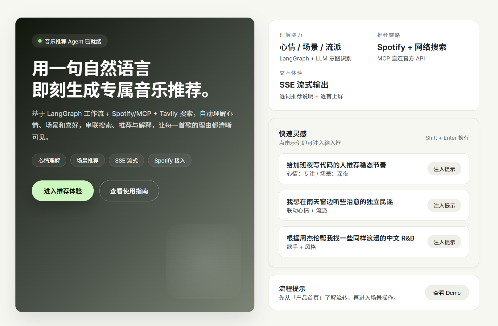
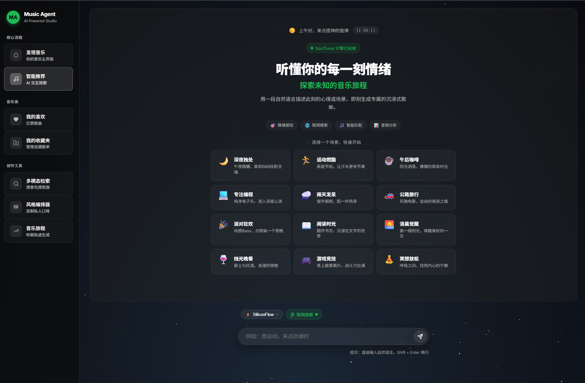
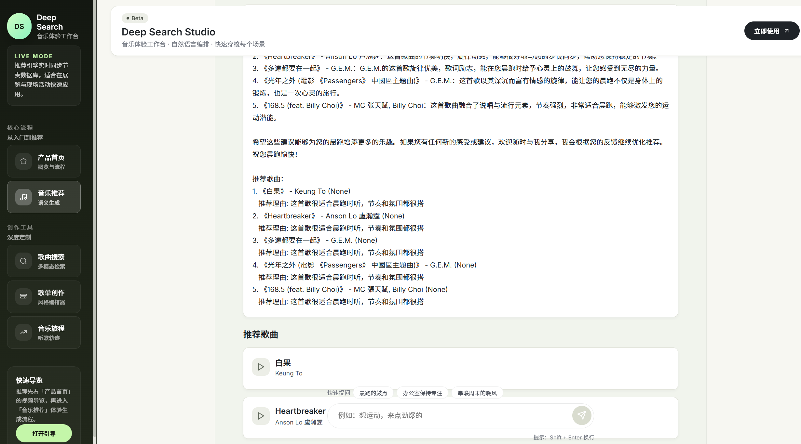
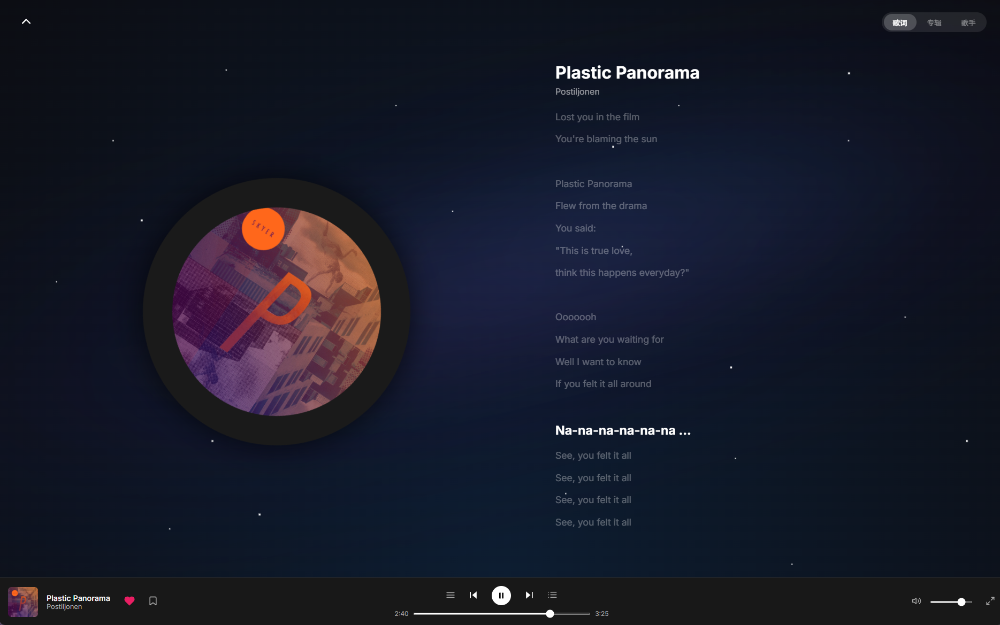
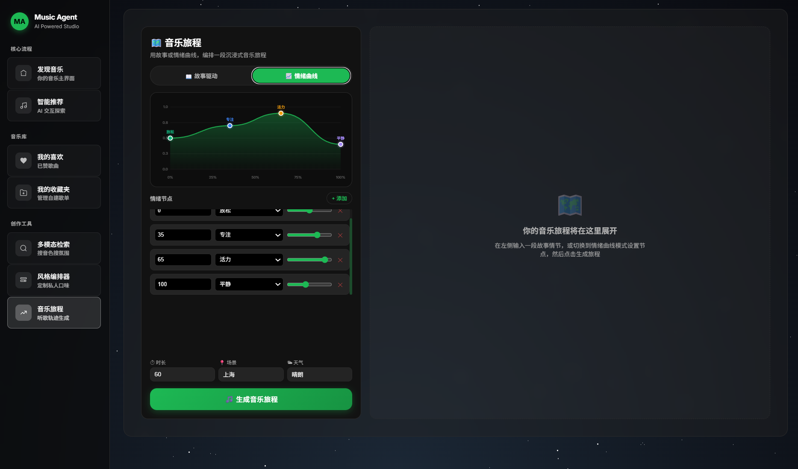

# 🎵 SoulTuner Agent

<p align="center">
  
</p>

<p align="center">
  <strong>用自然语言找音乐的本地 AI 智能体</strong>
</p>

<p align="center">
  
  
  
  
  
  
  <br/>
  
  
  
</p>

<p align="center">
  <a href="README.ch.md">中文</a> | <a href="README.md">English</a>
</p>

## 🎯 这是什么

SoulTuner 是一个**跑在你自己机器上**的音乐推荐智能体。你用一句人话描述想听什么，它负责听懂、找歌。

- 🗣️ **说人话就行** — "今天心情特别差，想一个人静一静"，不需要你先想好流派和关键词
- 🧠 **反馈会沉淀成画像** — 点赞、收藏、跳过和每次对话都会更新你的结构化偏好画像，对之后的排序做**轻推**。（曝光/反馈账本也在为一个离线学习的排序策略攒数据，但那条策略是**可选的、默认不训练也不上线**。）
- 🌐 **本地没有就去网上找** — 联网补充路线找有榜单/口碑/歌单支撑的歌（可一键关闭，关掉就是纯本地）
- 🗺️ **音乐旅程** — 描述一段故事或场景，AI 编排一整段有起承转合的歌单
- ♻️ **发现→试听→入库** — 遇到好歌先下载到暂存区试听，确认后一键入库并自动做声学分析

> 📖 完整功能与交互细节见 [Feature_Walkthrough.md](Feature_Walkthrough.md)

---

## 🖼️ 功能预览

<p align="center">
  <a href="https://www.bilibili.com/video/BV11dQLBDEeF/">
    
  </a>
</p>

### 🏠 首页 · 💬 对话 · 🎵 推荐 · 🎧 播放 · 🗺️ 旅程

<table>
  <tr>
    <td></td>
    <td></td>
  </tr>
  <tr>
    <td></td>
    <td></td>
  </tr>
  <tr>
    <td colspan="2"></td>
  </tr>
</table>

---

## 🚀 快速启动

```powershell
cd <你的项目目录>
Copy-Item .env.example .env
notepad .env
```

`.env` 里至少填这几项（默认用 DashScope / Qwen）：

```env
MAIN_LLM_PROVIDER=dashscope
MODEL_NAME=qwen3.7-plus
DASHSCOPE_API_KEY=你的 DashScope Key
NEO4J_PASSWORD=你的 Neo4j 密码
MUSIC_DATA_PATH=../data
```

然后启动，打开 `http://localhost:3003`：

```powershell
.\soultuner.ps1 up gpu
```

没有 NVIDIA 显卡就用 `.\soultuner.ps1 up cpu`（在线体验功能完整，只是不启动入库 Worker）。

想换模型厂商（SiliconFlow / Google / 火山 / 本地 SGLang、VLLM、Ollama），改 `MAIN_LLM_PROVIDER` 和 `MODEL_NAME` 并填对应 Key 即可，也可以启动后在前端「系统设置」里改。

<details>
<summary>其它常用命令</summary>

| 命令 | 用途 |
|---|---|
| `.\soultuner.ps1 doctor` | 检查各服务是否正常 |
| `.\soultuner.ps1 down` | 停止所有容器 |
| `.\soultuner.ps1 logs` | 查看服务日志 |
| `.\soultuner.ps1 test` | 运行单元测试 |
| `.\soultuner.ps1 ingest gpu` | 用 GPU Worker 处理待入库歌曲 |
| `python scripts/dev/start_backend.py` | 仅启动后端，供本地调试 |

</details>

---

## 🏗️ 架构

一次推荐请求会走完这条链路：

```
你说的一句话
     │
     ▼
┌──────────────────────────────────────────────────┐
│  Agent（LangGraph）                               │
│  召回记忆 → LLM 规划 → 按意图分流                  │
│  找歌 / 闲聊 / 获取歌曲 / 音乐旅程 / 澄清追问       │
└──────────────────────┬───────────────────────────┘
                       ▼
┌──────────────────────────────────────────────────┐
│  混合检索                                         │
│  图谱召回 ＋ 向量召回 ＋ 联网补充  →  融合 → 排序   │
└──────────────────────┬───────────────────────────┘
                       ▼
┌──────────────────────────────────────────────────┐
│  存储：Neo4j（图谱＋向量＋行为热路径）             │
│        SQLite（长期记忆账本 ＋ 反馈事件）          │
└──────────────────────┬───────────────────────────┘
                       ▼
        SSE 流式推送 → 前端（Next.js）
                       │
                       ▼
        你的反馈 ──────┘  记录下来，更新你的偏好画像
```

**两个设计选择值得单独说：**

**检索层只硬过滤"说死了的条件"。** 只有歌手、语言、地区进 WHERE；其余——情绪、场景、氛围，**连"只要纯音乐"也算**——都当作声学/语义意图，交给向量召回和排序，而不是用稀疏标签硬排除。这样"只听陈奕迅"不会跑偏，"安静、雨天、柔软"也不会被过滤成空结果。

**反馈分成两条互不干扰的通道。** 「喜欢这首歌」是长期口味，「这首适合我此刻要的吗」是当前这一组的判断——一首歌可以既是心头好又不适合今晚。混在一起会同时污染两边，所以分开记录。没评价的歌算「未知」，不当负样本。

### 技术栈

| 层 | 用什么 |
|---|---|
| 前端 | Next.js 14 + React 18 |
| 后端 | FastAPI + SSE 流式推送 |
| Agent | LangGraph StateGraph |
| 图数据库 | Neo4j 5.x（图谱关系 + 原生向量索引） |
| 文搜音 | MuQ-MuLan 主锚，M2D-CLAP 回退，OMAR-RQ 声学辅助 |
| 大语言模型 | 默认 `dashscope / qwen3.7-plus`，可换 provider |
| 长期记忆 | MemoryGateway：本地 SQLite 账本 + Neo4j 热路径，BGE 判相关性 |
| 排序 | RRF 融合 → 粗排 → 探索槽 → 内容双锚精排 → MMR 多样性 |
| 部署 | Docker Compose（CPU / GPU 两种入口） |

> 📖 推荐质量与对齐评测怎么跑，见 [tests/eval/README.md](tests/eval/README.md)

---

## 📁 项目结构

```
agent/       LangGraph 工作流与意图路由
retrieval/   混合检索、融合排序、音频编码、上下文管线
tools/       图谱检索 / 文搜音 / 联网发现 / 歌曲获取
services/    记忆网关、反馈事件、排序策略、外部服务客户端
schemas/     Pydantic 契约（状态、查询计划、反馈事件）
llms/        Provider 注册表与 Prompts
api/         FastAPI 接口层
data/        数据管线与蒸馏训练集
web/         Next.js 前端
tests/       单元测试 + 结果导向评测
```

---

## ⚙️ 配置

| 变量 | 说明 |
|---|---|
| `DASHSCOPE_API_KEY` | 默认模型的调用密钥（换 provider 就填对应厂商的） |
| `NEO4J_PASSWORD` | 本地 Neo4j 密码 |
| `MUSIC_DATA_PATH` | 音频、缓存、待入库队列、反馈日志的存放目录 |
| `MUSIC_WEB_SEARCH_ENABLED` | 是否允许联网补充候选 |
| `ADMIN_API_KEY` | 多人或局域网部署时保护管理接口 |

更多高级选项见 `.env.example`，普通使用不需要动。

---

## 🙏 致谢

本项目初始架构参考自 [imagist13/Muisc-Research](https://github.com/imagist13/Muisc-Research)，在此基础上做了大规模重构与功能扩展。

| 项目 | 用途 |
|---|---|
| [OpenMuQ/MuQ](https://github.com/OpenMuQ/MuQ) | MuQ-MuLan 文搜音主模型（CC-BY-NC 4.0） |
| [nttcslab/m2d](https://github.com/nttcslab/m2d) | M2D-CLAP 回退与辅助语义模型 |
| [MTG/omar-rq](https://github.com/MTG/omar-rq) | OMAR-RQ 音频表示模型 |
| [aexy-io/graphzep](https://github.com/aexy-io/graphzep) | legacy 记忆适配器（可选、非默认） |

---

## 📚 参考文献

### 系统里真正实现了的

| 文献 | 对应到哪 |
|---|---|
| Zhu, H. et al. (2025). *MuQ / MuQ-MuLan: Self-Supervised Music Representation Learning with Mel Residual Vector Quantization.* [arXiv:2501.01108](https://arxiv.org/abs/2501.01108) | 文搜音主锚 |
| Niizumi, D. et al. (2025). *M2D-CLAP: Exploring General-purpose Audio-Language Representations Beyond CLAP.* (IEEE Access) [arXiv:2503.22104](https://arxiv.org/abs/2503.22104) | 文搜音回退 + 语义精排 |
| Alonso-Jiménez, P. et al. (2025). *OMAR-RQ: Open Music Audio Representation Model.* (ACM MM 2025) [arXiv:2507.03482](https://arxiv.org/abs/2507.03482) | 声学相似性辅助锚 |
| Gao, L. et al. (2023). *Precise Zero-Shot Dense Retrieval without Relevance Labels*（HyDE）. (ACL 2023) | 把用户的话先写成假想音乐描述再检索 |
| Xu, W. et al. (2025). *A-MEM: Agentic Memory for LLM Agents.* [arXiv:2502.12110](https://arxiv.org/abs/2502.12110) | **受 A-MEM 启发**的记忆互链/演化——是借鉴思路，非完整复现 |

RRF 融合、MMR 多样性、Thompson Sampling 探索、无偏 LTR、BGE 相关性这些经典构件也在用，但放在**代码注释和技术报告**里就近说明，不在这里作为主参考文献罗列。

### 影响了设计、但还没实现的

列在这里是为了说明"为什么这么设计"，代码里目前没有对应实现。

- Palumbo, E. et al. (Spotify, 2025). *You Say Search, I Say Recs.* (RecSys 2025) — 与本项目 router 最接近：Agent 做查询理解 + 多工具并行的探索式推荐
- Wang, Y. et al. (2023). *RecMind: Large Language Model Powered Agent for Recommendation.* [arXiv:2308.14296](https://arxiv.org/abs/2308.14296) — LLM 推荐 Agent 与工具规划
- Wu, D. et al. (2025). *LongMemEval: Benchmarking Chat Assistants on Long-Term Interactive Memory.* (ICLR 2025) — 密封记忆评测的设计蓝本（抽取/多会话/时间/更新/拒答）
- Manco, I. et al. (2023). *The Song Describer Dataset.* [arXiv:2311.10057](https://arxiv.org/abs/2311.10057) — 音乐-语言检索/caption 的公开评测数据
- Rasmussen, P. et al. (2025). *Zep: A Temporal Knowledge Graph Architecture for Agent Memory.* — 记忆分层的思路来源；GraphZep 适配器现已降级为可选 legacy

---

## 📄 许可证

- **SoulTuner 源码**：MIT（见 [LICENSE](LICENSE)）。
- **MuQ-MuLan 模型权重**：CC-BY-NC 4.0，**仅限非商业用途**。默认配置会下载这份权重，因此**若要商用默认配置，必须替换这些权重或另行取得受限模型的授权**。M2D-CLAP、OMAR-RQ 各自遵循其上游许可证。

⚠️ **免责声明**：本项目仅供学习与架构研究。不提供、不包含也不分发任何受版权保护的音频或歌词资源，音频数据需用户自行通过合法渠道获取。
