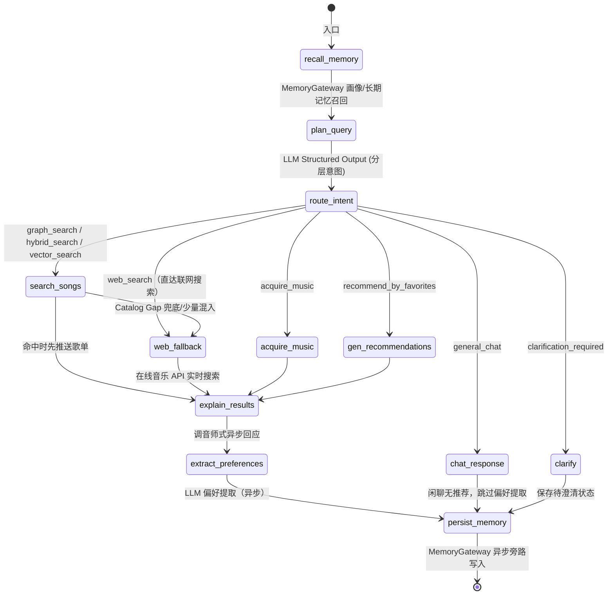

# 🎵 SoulTuner Agent

<p align="center">
  
</p>

<p align="center">
  <strong>多模态音乐推荐智能体 — Hybrid RAG × Knowledge Graph × Long-term Memory</strong>
</p>

<p align="center">
  
  
  
  
  
  
  <br/>
  
  
  
</p>

<p align="center">
  <a href="README.md">中文</a> | <a href="README_EN.md">English</a>
</p>

## 🎯 用自然语言发现音乐，让 AI 真正听懂你

SoulTuner 是一款**本地部署**的 AI 音乐推荐智能体。它不是简单的"搜歌→播放"工具，而是一个能**持续学习你音乐品味**的私人 DJ：

- 🗣️ **用自然语言描述你想听的** — "我今天心情特别差，想一个人静一静"，系统自动识别情绪与场景，推荐契合当下状态的音乐
- 🧠 **越用越懂你** — 每一次点赞、收藏、跳过和对话，都在无声构建你的个性化音乐画像，下次推荐更精准
- 🌐 **本地曲库不够？实时联网补充** — Catalog Gap Detector 判断本地库是否缺歌/缺年份等元数据，必要时自动联网补足候选
- 🗺️ **沉浸式音乐旅程** — 描述一段故事或场景，AI 为你编排一整段有起承转合的音乐旅程
- ♻️ **发现→暂存→入库** — 推荐中遇到好歌？先下载到「待入库」预览试听，确认后一键入库并自动进行声学分析

> 📖 完整功能与交互细节请参阅 [Feature_Walkthrough.md](Feature_Walkthrough.md)
>
> 融合知识图谱（Neo4j）、MuQ-MuLan 文搜音主锚、M2D-CLAP / OMAR-RQ 辅助音频表示、大语言模型和 MemoryGateway 记忆层，通过 LangGraph 编排的多节点 Agent 工作流，实现多路混合检索、加权 RRF 融合、Neo4j 图距离加权、SSE 流式推荐、联网搜索回退、音乐旅程编排和用户行为数据飞轮。

---

## 🖼️ 功能预览

### 🏠 首页 · 💬 对话 · 🎵 推荐 · 🎧 播放 · 🗺️ 旅程

<table>
  <tr>
    <td></td>
    <td></td>
  </tr>
  <tr>
    <td></td>
    <td></td>
  </tr>
  <tr>
    <td colspan="2"></td>
  </tr>
</table>

---

## 🚀 快速启动

```powershell
# 先进入你克隆下来的项目根目录
cd <你的项目目录>
Copy-Item .env.example .env
notepad .env
```

默认模型配置使用 DashScope / Qwen。你也可以切换成其它模型提供商，只需要同步修改 `MAIN_LLM_PROVIDER`、`MODEL_NAME`，并填写对应 provider 的 API Key。

如果使用默认配置，在 `.env` 里至少填写：

```env
MAIN_LLM_PROVIDER=dashscope
MODEL_NAME=qwen3.7-plus
DASHSCOPE_API_KEY=你的 DashScope Key
NEO4J_PASSWORD=你的 Neo4j 密码
MUSIC_DATA_PATH=../data
```

如果使用其它模型提供商，例如 SiliconFlow、Google、Volcengine、本地 SGLang/VLLM/Ollama，请把 `MAIN_LLM_PROVIDER` 和 `MODEL_NAME` 改成对应值，并填写 `.env.example` 中对应的 Key 或服务地址。也可以启动后在前端「系统设置」里调整模型配置。

然后回到 PowerShell 运行：

```powershell
.\soultuner.ps1 up gpu
```

启动完成后打开 `http://localhost:3003`。如果想确认服务是否正常：

```powershell
.\soultuner.ps1 doctor
```

如果没有 NVIDIA GPU，或者只是想用较轻量的回退模式体验，可以改用：

```powershell
.\soultuner.ps1 up cpu
```

<details>
<summary>其它常用命令</summary>

| 命令 | 用途 |
|---|---|
| `.\soultuner.ps1 down` | 停止所有容器 |
| `.\soultuner.ps1 logs` | 查看服务日志 |
| `.\soultuner.ps1 test` | 运行单元测试 |
| `.\soultuner.ps1 ingest gpu` | 使用 GPU Worker 处理待入库歌曲 |
| `python scripts/dev/start_backend.py` | 仅启动后端，供本地调试 |

</details>

---

## ✨ 核心特性

| 特性                       | 说明                                                                 |
| -------------------------- | -------------------------------------------------------------------- |
| 🔀**Hybrid RAG**     | 图谱 / 稠密 / BM25 三路内容召回，加权 RRF 融合；个性化与冷门探索作为召回后加分/减分项 |
| 🎵**多模态文搜音** | MuQ-MuLan 负责中文优先的文搜音召回，M2D-CLAP 自动回退，OMAR-RQ 补充声学相似性 |
| 🧠**长期记忆**       | MemoryGateway 统一入口：Neo4j 行为热路径 + GraphZep/Mem0 可选旁路，前端可编辑学习偏好 |
| 📊**粗排+探索**      | Graph Affinity 粗排截断 + Thompson Sampling 冷门探索槽               |
| 🤖**智能意图识别**   | 分层意图表示 `hard_constraints / soft_intent / hints` + 多轮继承      |
| 👤**用户画像**       | 前端可视化画像面板，流派/情绪/场景/语言偏好 → Neo4j 热路径 + 长期记忆旁路 |
| 🌐**联网搜索回退**   | 默认开启；本地库足够时少量混入在线候选，本地缺口时自动触发 SearxNG/Tavily/智谱候选发现 + 网易云可播放解析 |
| 🎼**音乐旅程**       | LLM 故事→情绪拆解→逐段检索，SSE 实时推送                           |
| ♻️**数据飞轮**     | 下载→暂存→试听→确认入库→标签提取→向量编码→Neo4j                |
| 📋**曲库管理**       | 待入库暂存区 + 入库队列状态/失败重试 + 我的曲库全图谱管理（搜索/播放/标签编辑/删除） |
| 📡**SSE 流式**       | 前端实时渲染 thinking → 歌曲卡片 → 推荐理由                        |
| 🐳**Docker 部署**    | `docker compose up` 一键启动全栈                                   |

---

## 🏗️ 系统架构

```
┌─────────────────────────────────────────────────────────────────────┐
│  Frontend (Next.js :3003)                                           │
│  React UI  ·  Global Audio Player  ·  Music Journey  ·  Settings   │
└──────────────────────────────┬──────────────────────────────────────┘
                               │ SSE
┌──────────────────────────────▼──────────────────────────────────────┐
│  Backend (FastAPI :8501)                                            │
│  SSE Streaming API  ·  Settings API  ·  Static Audio Server        │
└──────────────────────────────┬──────────────────────────────────────┘
                               │
┌──────────────────────────────▼──────────────────────────────────────┐
│  LangGraph Agent (StateGraph)                                       │
│                                                                     │
│  start → MemoryGateway Recall → Planner (LLM) → Intent Router     │
│                                                                     │
│     ┌─────────┬─────────┬─────────┬──────────┐                     │
│     ▼         ▼         ▼         ▼          ▼                     │
│  search_songs  chat  acquire  gen_reco  journey                    │
│     │                                                               │
│     ▼                                                               │
│  Hybrid Retrieval ──→ LLM Explainer ──→ Pref Extract ──→ MemoryGateway Write → end │
└──────────────────────────────┬──────────────────────────────────────┘
                               │
┌──────────────────────────────▼──────────────────────────────────────┐
│  Hybrid Retrieval Engine                                            │
│                                                                     │
│  GraphRAG · Dense KNN · BM25 · Catalog Gap / Web Fallback          │
│         └──────────────────┬───────────────────┘                   │
│                            ▼                                        │
│              Weighted RRF Fusion (保留各路 rank 与来源)               │
│                            ▼                                        │
│              Coarse Rank (Graph Affinity 粗排截断)                   │
│                            ▼                                        │
│              Thompson Sampling (冷门歌探索槽)                        │
│                            ▼                                        │
│              Content-Anchor Rerank (语义+声学归一化精排)            │
│                            ▼                                        │
│              MMR Multi-dim Diversity (λ=0.7)                       │
└─────────────────────────────────────────────────────────────────────┘
                               │
┌──────────────────────────────▼──────────────────────────────────────┐
│  Storage Layer                                                      │
│  Neo4j (Graph + Vectors + Memory Hot Path) · Optional Memory Sidecars │
└─────────────────────────────────────────────────────────────────────┘
```

### 技术栈

| 层                   | 技术                                                                                    |
| -------------------- | --------------------------------------------------------------------------------------- |
| **前端**       | Next.js 14 + React 18                                                                   |
| **Agent**      | LangGraph StateGraph（分层意图计划 + 多路召回路由）                                     |
| **后端**       | FastAPI + SSE 流式推送                                                                  |
| **图数据库**   | Neo4j 5.x（原生向量索引 + 图谱关系 + 用户行为直写）                                     |
| **音频嵌入**   | MuQ-MuLan（文搜音主锚，512d）+ M2D-CLAP（语义回退/精排，768d）+ OMAR-RQ（声学辅助，1024d） |
| **大语言模型** | 默认 `dashscope / qwen3.7-plus`；其它 provider 只作为高级自定义项 |
| **长期记忆**   | MemoryGateway（Neo4j 热路径 + GraphZep/Mem0 可选 episodic sidecar）                     |
| **联网搜索**   | SearxNG 联邦搜索 + Tavily + 智谱 WebSearch                                              |
| **排序算法**   | 内容双锚精排（语义+声学）+ 限幅召回后校正 + Thompson Sampling 探索 + MMR  |
| **上下文管理** | GSSC Token 预算管线（Gather/Select/Structure/Compress + 异步预压缩缓存）                |
| **容器化**     | Docker Compose（CPU/GPU 两种入口；CPU 已含完整在线体验，GPU 额外启动入库 Worker） |

> 📖 推荐质量与对齐评测的运行方式见 [tests/eval/README.md](tests/eval/README.md)。

---

## 🔬 技术说明

### RAG 混合检索流水线

```
用户查询 → Planner (LLM) 输出分层计划
              ↓  hard_constraints + soft_intent + hints + intent_type
   ┌──────────┬──────────┬──────────┐
   ▼          ▼          ▼
GraphRAG   Dense KNN   BM25              ← Step 1: 三路内容召回
(Neo4j)   (MuQ+OMAR) (标题/歌手/歌词)
   └──────────┴──────────┴──────────┘
              ▼
  Step 2: 加权 RRF 融合                 ← 保留各路 rank 与来源
              ▼
  Step 3: hard_constraints + DISLIKES   ← 唯一硬过滤；mood/scenario/genre 不进 WHERE
              ▼
  Step 4: Artist 多样性初筛             ← 每歌手 ≤ N 首（指定歌手豁免）
              ▼
  Step 5: 召回后加分/减分 + TS 探索     ← 个性化/新歌/冷门加分，过曝按时间衰减降分
              ▼
  Step 6: 内容双锚归一化精排            ← 主文搜音锚(MuQ/M2D fallback) + 种子声学锚(OMAR-RQ)
              ▼
  Step 7: MMR 多维多样性重排 + FinalCut
```

检索层只把明确实体、语言、纯音乐等条件作为硬约束；情绪、场景、氛围和用户偏好都进入排序。这样既能保证“只听某个歌手”这类请求不跑偏，也能避免“安静、雨天、柔软”这类软需求被粗暴过滤成空结果。

多路召回会保留来源与排名，最终推荐卡片可展示“图谱检索 / 向量检索 / 词法检索 / 联网候选”等来源信息，方便用户理解结果从哪里来。

### Agent 工作流



### 记忆与反馈

MemoryGateway 统一处理用户画像、行为反馈和可选长期记忆旁路。Neo4j 保留点赞、收藏、跳过、拉黑等结构化行为；GraphZep/Mem0 作为可选扩展，不影响主推荐链路。

前端的画像设置、歌曲反馈和歌单级反馈会逐步影响排序，但不会覆盖当轮查询本身的内容相关性。

---

## 📁 项目结构

```
.
├── agent/                      # LangGraph Agent
│   ├── music_agent.py          # Agent 主入口
│   └── music_graph.py          # StateGraph 工作流（7 意图路由）
│
├── api/                        # FastAPI 接口层
│   ├── server.py               # 主服务 + Settings API
│   └── user_profile.py         # 用户画像 API（GET/POST /api/user-profile）
│
├── config/settings.py          # 全局配置（支持运行时修改）
│
├── retrieval/                  # 检索引擎层
│   ├── hybrid_retrieval.py     # 多路融合 + 限幅校正/TS + 内容双锚精排 + MMR
│   ├── gssc_context_builder.py # GSSC 上下文管线（Token 预算 + LLM 压缩 + 异步预压缩缓存）
│   ├── muq_embedder.py         # MuQ-MuLan 音频/文本编码
│   ├── audio_embedder.py       # M2D-CLAP 回退与语义精排编码
│   ├── neo4j_client.py         # Neo4j 连接封装
│   ├── music_journey.py        # 音乐旅程编排器
│   └── user_memory.py          # 用户偏好 Neo4j 记忆
│
├── tools/                      # 工具层
│   ├── graphrag_search.py      # 知识图谱检索（Neo4j Cypher，五维标签）
│   ├── semantic_search.py      # 文搜音检索（MuQ 主、M2D 回退、OMAR 辅助）
│   ├── web_search_aggregator.py # 联网搜索聚合（SearxNG + Tavily）
│   └── acquire_music.py        # 歌曲获取与待入库工具
│
├── llms/                       # LLM 接口 + Prompts
│   ├── prompts.py              # Planner Prompt + 辅助 Prompt
│   ├── registry.py             # Provider 注册表 + 环境变量注入
│   ├── chat_models.py          # LangChain ChatModel 工厂
│   ├── native.py               # 原生 LiteLLM 字符串调用器
│   └── multi_llm.py            # 兼容旧 import 的门面
│
├── schemas/                    # Pydantic 数据模型
│   └── query_plan.py           # MusicQueryPlan + RetrievalPlan
│
├── services/                   # 记忆网关、反馈日志、外部服务客户端
│
├── data/pipeline/              # 数据管线
│   ├── ingest_to_neo4j.py      # Neo4j 入库
│   ├── neo4j_schema_v2.py      # 数据集管理工具
│   └── lyrics_analyzer.py      # LLM 歌词标签分析
│
├── web/                        # Next.js 前端
│   ├── components/Settings/    # ⚙️ 运行时设置面板
│   ├── components/Profile/     # 👤 用户画像面板
│   └── components/Navigation/  # 导航、侧边栏
│   └── app/library/            # 音乐库页面（待入库 / 我的曲库 / 喜欢 / 收藏）
│
├── graphzep_service/           # 可选 GraphZep 记忆旁路服务
├── deploy/legacy/              # legacy 单服务调试 compose（主路径使用根目录 docker-compose.yml）
├── scripts/dev/                # 本地分步调试启动脚本
├── tests/                      # 测试与评测
│   ├── unit/                   # 单元测试
│   │   ├── test_normalize_key.py
│   │   ├── test_gssc_token_budget.py
│   │   ├── test_tag_expansion.py
│   │   ├── test_merge_dedup.py
│   │   └── test_schema_validation.py
│   └── eval/                   # 结果导向评测
│       ├── cases/                    # dev / holdout outcome 用例
│       └── evaluate_outcomes.py      # 推荐质量尺子
├── .github/workflows/ci.yml    # GitHub Actions CI
├── docker-compose.yml          # Docker 全栈编排
├── Dockerfile                  # 后端镜像
├── pyproject.toml              # 项目配置 (mypy + ruff + pytest)
├── .env.example                # 环境变量模板
├── scripts/dev/start_backend.py # 后端本地调试入口
└── requirements.txt            # Python 依赖
```

---

## ⚙️ 配置

### 环境变量

| 变量 | 说明 |
| --- | --- |
| `DASHSCOPE_API_KEY` | 默认 DashScope / Qwen 模型调用密钥；切换 provider 时填写对应厂商 Key |
| `NEO4J_PASSWORD` | 本地 Neo4j 密码 |
| `MUSIC_DATA_PATH` | 音频、缓存、待入库队列和反馈日志目录 |
| `MUSIC_WEB_SEARCH_ENABLED` | 是否允许联网补充候选 |
| `ADMIN_API_KEY` | 多人或局域网部署时保护管理接口 |
| `QDRANT_IMAGE` | Qdrant 镜像源；网络拉取慢时可换成国内镜像 |

更多高级选项见 `.env.example`，普通使用不需要逐项调整。

---

## 🙏 致谢

本项目初始架构参考自 [imagist13/Muisc-Research](https://github.com/imagist13/Muisc-Research)，在此基础上进行了大规模重构与功能扩展。

| 项目                                                 | 用途                |
| ---------------------------------------------------- | ------------------- |
| [aexy-io/graphzep](https://github.com/aexy-io/graphzep) | 可选长期记忆旁路   |
| [OpenMuQ/MuQ](https://github.com/OpenMuQ/MuQ)             | MuQ-MuLan 文搜音主模型（CC-BY-NC 4.0） |
| [nttcslab/m2d](https://github.com/nttcslab/m2d)         | M2D-CLAP 回退与辅助语义模型 |
| [MTG/omar](https://github.com/MTG/omar)                 | OMAR-RQ 音频模型    |

---

## 📚 参考文献

1. Niizumi, D. et al. (2025). *M2D-CLAP: Exploring General-purpose Audio-Language Representations Beyond CLAP.*
2. Alonso-Jiménez, P. et al. (2025). *OMAR-RQ: Open Music Audio Representation Model Trained with Multi-Feature Masked Token Prediction.*
3. Rasmussen, P. et al. (2025). *Zep: A Temporal Knowledge Graph Architecture for Agent Memory.*
4. Palumbo, E. et al. (Spotify, 2025). *You Say Search, I Say Recs: A Scalable Agentic Approach to Query Understanding and Exploratory Search.* (RecSys 2025)
5. D'Amico, E. et al. (Spotify, 2025). *Deploying Semantic ID-based Generative Retrieval for Large-Scale Podcast Discovery at Spotify.*
6. Penha, G. et al. (2025). *Semantic IDs for Joint Generative Search and Recommendation.* (RecSys 2025 LBR)
7. Palumbo, E. et al. (2025). *Text2Tracks: Prompt-based Music Recommendation via Generative Retrieval.*
8. Xu, S. et al. (2025). *Climber: Toward Efficient Scaling Laws for Large Recommendation Models.*
9. Wang, S. et al. (2025). *Knowledge Graph Retrieval-Augmented Generation for LLM-based Recommendation.* (ACL 2025)

---

## 📄 许可证

MIT License

⚠️ **免责声明**：本项目仅供学习与架构研究，**严禁商业用途**。不提供、不包含也不分发任何受版权保护的音频或歌词资源。音频数据需用户自行通过合法渠道获取。
