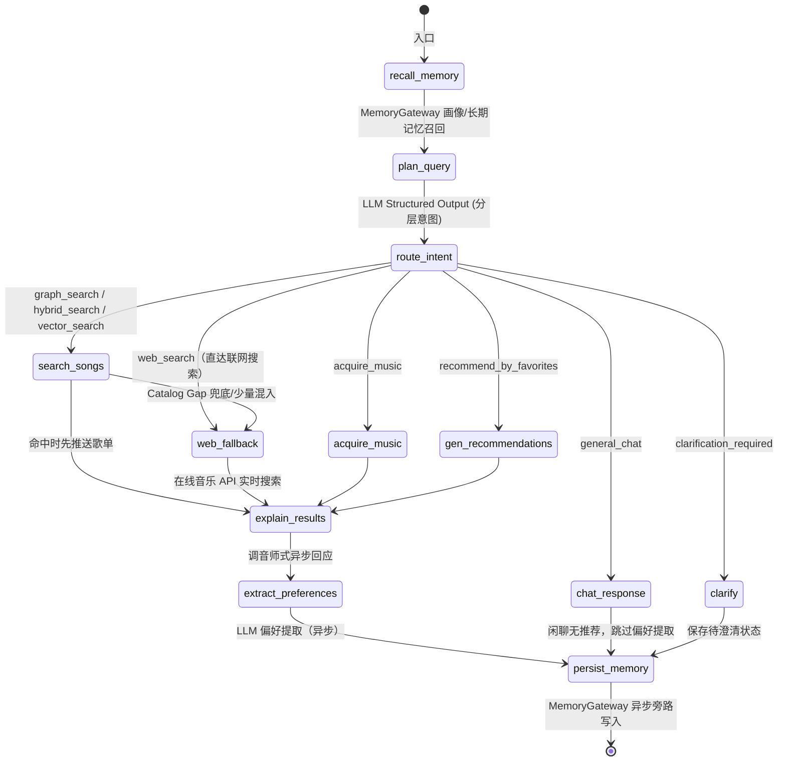
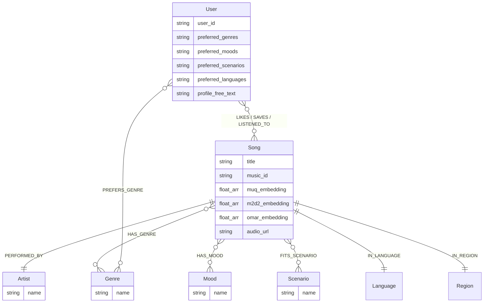

# 🎵 SoulTuner Agent

<p align="center">
  
</p>

<p align="center">
  <strong>多模态音乐推荐智能体 — Hybrid RAG × Knowledge Graph × Long-term Memory</strong>
</p>

<p align="center">
  
  
  
  
  
  
  <br/>
  
  
  
</p>

<p align="center">
  <a href="README.md">中文</a> | <a href="README_EN.md">English</a>
</p>

## 🎯 用自然语言发现音乐，让 AI 真正听懂你

SoulTuner 是一款**本地部署**的 AI 音乐推荐智能体。它不是简单的"搜歌→播放"工具，而是一个能**持续学习你音乐品味**的私人 DJ：

- 🗣️ **用自然语言描述你想听的** — "我今天心情特别差，想一个人静一静"，系统自动识别情绪与场景，推荐契合当下状态的音乐
- 🧠 **越用越懂你** — 每一次点赞、收藏、跳过和对话，都在无声构建你的个性化音乐画像，下次推荐更精准
- 🌐 **本地曲库不够？实时联网补充** — Catalog Gap Detector 判断本地库是否缺歌/缺年份等元数据，必要时自动联网补足候选
- 🗺️ **沉浸式音乐旅程** — 描述一段故事或场景，AI 为你编排一整段有起承转合的音乐旅程
- ♻️ **发现→暂存→入库** — 推荐中遇到好歌？先下载到「待入库」预览试听，确认后一键入库并自动进行声学分析

> 📖 完整功能与交互细节请参阅 [Feature_Walkthrough.md](Feature_Walkthrough.md)
>
> 融合知识图谱（Neo4j）、MuQ-MuLan 文搜音主锚、M2D-CLAP / OMAR-RQ 辅助音频表示、大语言模型和 MemoryGateway 记忆层，通过 LangGraph 编排的多节点 Agent 工作流，实现多路混合检索、加权 RRF 融合、Neo4j 图距离加权、SSE 流式推荐、联网搜索回退、音乐旅程编排和用户行为数据飞轮。

---

## 🚀 普通用户 · Docker 一键（3 步）

```powershell
Copy-Item .env.example .env
# 编辑 .env：至少填写 NEO4J_PASSWORD 与 DASHSCOPE_API_KEY
.\soultuner.ps1 up cpu        # CPU 完整体验：Neo4j + 后端 + 前端 + 可选记忆旁路 + SearxNG + 网易云代理
.\soultuner.ps1 doctor        # 绿灯后打开 http://localhost:3003
```

CPU 和 GPU 都能启动完整产品功能。区别只在多模态质量与入库吞吐：`up cpu` 默认用资源更轻的 M2D 文搜音回退，Neo4j / 推荐 / 联网 / 前端全可用；有 NVIDIA GPU 时，把第三行改成 `.\soultuner.ps1 up gpu`，后端会启用 MuQ-MuLan fp16 文搜音主锚，并同时启动独立入库 Worker。默认记忆使用 Neo4j 热路径，不再强制启动 GraphZep；如果要实验自然语言长期记忆旁路，在 `.env` 设置 `MEMORY_EPISODIC_BACKENDS=graphzep` 或 `graphzep,mem0` 后再启动。

公开演示请不要直接暴露个人曲库服务。将 `.env` 里的 `PUBLIC_DEMO_MODE=true` 并配置 `ADMIN_API_KEY` 后，下载、入库、删除等本地破坏性操作会被禁用或要求 `X-API-Key`；公开 Demo 仍建议只使用 CC/open 曲库或 mock 音频。

### CC-only Gradio 公开演示

如果只想做作品展示，不暴露个人曲库，可以启动一个轻量 Gradio demo。它默认读取仓库外的 MTG-Jamendo CC sample，只做标签/场景推荐，不连接私人 Neo4j 曲库，也不会执行下载、入库或删除。Demo 只加载 CC / Jamendo / MTG 来源的元数据，并会拒绝指向 `processed_audio`、`online_audio`、`download` 等私人/运行时曲库路径。

```powershell
python -m pip install -r requirements-demo.txt
$env:PUBLIC_DEMO_MODE = "1"
$env:PUBLIC_DEMO_DATA_DIR = "C:\Users\sanyang\sanyangworkspace\music_recommendation\data\mtg_sample"
python demos/public_gradio_app.py
```

这个 demo 适合 Hugging Face Spaces / 魔搭作品页的公开展示；完整产品体验仍使用上面的 Docker + Next.js / FastAPI 入口。

<details>
<summary>本地开发 / GPU 入库 / 手动分步</summary>

- 本地开发：创建 `music_agent` Conda 环境，安装 Python 与 `web/` 前端依赖后运行 `python startup_all.py`。
- 模型缓存：Docker 默认允许首次启动自动补齐缺失的 HuggingFace 文本编码器，保证向量检索可用；如需完全离线，可先运行 `python scripts/download_models.py`，再把 `.env` 的 `HF_OFFLINE` 设为 `true`。
- GPU 入库：日常在线推荐不需要 GPU；音频向量提取和批量入库放在 `.\soultuner.ps1 up gpu` 或 `.\soultuner.ps1 ingest gpu`。
- 手动分步：Neo4j `:7687`、Backend `:8501`、Frontend `:3003`；GraphZep `:3100` 只是 MemoryGateway 的可选旁路。

</details>

---

## ✨ 核心特性

| 特性                       | 说明                                                                 |
| -------------------------- | -------------------------------------------------------------------- |
| 🔀**Hybrid RAG**     | 图谱 / 稠密 / BM25 三路内容召回，加权 RRF 融合；个性化与冷门探索作为召回后加分/减分项 |
| 🎵**多模态文搜音** | MuQ-MuLan 负责中文优先的文搜音召回，M2D-CLAP 自动回退，OMAR-RQ 补充声学相似性 |
| 🧠**长期记忆**       | MemoryGateway 统一入口：Neo4j 行为热路径 + GraphZep/Mem0 可选旁路，前端可编辑学习偏好 |
| 📊**粗排+探索**      | Graph Affinity 粗排截断 + Thompson Sampling 冷门探索槽               |
| 🤖**智能意图识别**   | 分层意图表示 `hard_constraints / soft_intent / hints` + 多轮继承      |
| 👤**用户画像**       | 前端可视化画像面板，流派/情绪/场景/语言偏好 → Neo4j 热路径 + 长期记忆旁路 |
| 🌐**联网搜索回退**   | 默认开启；本地库足够时少量混入在线候选，本地缺口时自动触发 SearxNG/Tavily/智谱候选发现 + 网易云可播放解析 |
| 🎼**音乐旅程**       | LLM 故事→情绪拆解→逐段检索，SSE 实时推送                           |
| ♻️**数据飞轮**     | 下载→暂存→试听→确认入库→标签提取→向量编码→Neo4j                |
| 📋**曲库管理**       | 待入库暂存区 + 入库队列状态/失败重试 + 我的曲库全图谱管理（搜索/播放/标签编辑/删除） |
| 📡**SSE 流式**       | 前端实时渲染 thinking → 歌曲卡片 → 推荐理由                        |
| 🐳**Docker 部署**    | `docker compose up` 一键启动全栈                                   |

---

## 🖼️ 功能预览

<div align="center">
<h3>🎬 快速了解 SoulTuner 的功能</h3>
<p>
  <a href="https://www.bilibili.com/video/BV11dQLBDEeF/">
    
  </a>
</p>
</div>

### 🏠 首页 · 💬 对话 · 🎵 推荐 · 🎧 播放 · 🗺️ 旅程

<table>
  <tr>
    <td></td>
    <td></td>
  </tr>
  <tr>
    <td></td>
    <td></td>
  </tr>
  <tr>
    <td colspan="2"></td>
  </tr>
</table>

---

## 🏗️ 系统架构

```
┌─────────────────────────────────────────────────────────────────────┐
│  Frontend (Next.js :3003)                                           │
│  React UI  ·  Global Audio Player  ·  Music Journey  ·  Settings   │
└──────────────────────────────┬──────────────────────────────────────┘
                               │ SSE
┌──────────────────────────────▼──────────────────────────────────────┐
│  Backend (FastAPI :8501)                                            │
│  SSE Streaming API  ·  Settings API  ·  Static Audio Server        │
└──────────────────────────────┬──────────────────────────────────────┘
                               │
┌──────────────────────────────▼──────────────────────────────────────┐
│  LangGraph Agent (StateGraph)                                       │
│                                                                     │
│  start → MemoryGateway Recall → Planner (LLM) → Intent Router     │
│                                                                     │
│     ┌─────────┬─────────┬─────────┬──────────┐                     │
│     ▼         ▼         ▼         ▼          ▼                     │
│  search_songs  chat  acquire  gen_reco  journey                    │
│     │                                                               │
│     ▼                                                               │
│  Hybrid Retrieval ──→ LLM Explainer ──→ Pref Extract ──→ MemoryGateway Write → end │
└──────────────────────────────┬──────────────────────────────────────┘
                               │
┌──────────────────────────────▼──────────────────────────────────────┐
│  Hybrid Retrieval Engine                                            │
│                                                                     │
│  GraphRAG · Dense KNN · BM25 · Catalog Gap / Web Fallback          │
│         └──────────────────┬───────────────────┘                   │
│                            ▼                                        │
│              Weighted RRF Fusion (保留各路 rank 与来源)               │
│                            ▼                                        │
│              Coarse Rank (Graph Affinity 粗排截断)                   │
│                            ▼                                        │
│              Thompson Sampling (冷门歌探索槽)                        │
│                            ▼                                        │
│              Content-Anchor Rerank (语义+声学归一化精排)            │
│                            ▼                                        │
│              MMR Multi-dim Diversity (λ=0.7)                       │
└─────────────────────────────────────────────────────────────────────┘
                               │
┌──────────────────────────────▼──────────────────────────────────────┐
│  Storage Layer                                                      │
│  Neo4j (Graph + Vectors + Memory Hot Path) · Optional Memory Sidecars │
└─────────────────────────────────────────────────────────────────────┘
```

### 技术栈

| 层                   | 技术                                                                                    |
| -------------------- | --------------------------------------------------------------------------------------- |
| **前端**       | Next.js 14 + React 18                                                                   |
| **Agent**      | LangGraph StateGraph（分层意图计划 + 多路召回路由）                                     |
| **后端**       | FastAPI + SSE 流式推送                                                                  |
| **图数据库**   | Neo4j 5.x（原生向量索引 + 图谱关系 + 用户行为直写）                                     |
| **音频嵌入**   | MuQ-MuLan（文搜音主锚，512d）+ M2D-CLAP（语义回退/精排，768d）+ OMAR-RQ（声学辅助，1024d） |
| **大语言模型** | 默认 `dashscope / qwen3.7-plus`；其它 provider 只作为高级自定义项 |
| **长期记忆**   | MemoryGateway（Neo4j 热路径 + GraphZep/Mem0 可选 episodic sidecar）                     |
| **联网搜索**   | SearxNG 联邦搜索 + Tavily + 智谱 WebSearch                                              |
| **排序算法**   | 内容双锚精排（语义+声学）+ 限幅召回后校正 + Thompson Sampling 探索 + MMR  |
| **上下文管理** | GSSC Token 预算管线（Gather/Select/Structure/Compress + 异步预压缩缓存）                |
| **容器化**     | Docker Compose（CPU/GPU 两种入口；CPU 已含完整在线体验，GPU 额外启动入库 Worker） |

> 📖 推荐质量与对齐评测的运行方式见 [tests/eval/README.md](tests/eval/README.md)。

---

## 🔬 技术深度

### RAG 混合检索流水线

```
用户查询 → Planner (LLM) 输出分层计划
              ↓  hard_constraints + soft_intent + hints + intent_type
   ┌──────────┬──────────┬──────────┐
   ▼          ▼          ▼
GraphRAG   Dense KNN   BM25              ← Step 1: 三路内容召回
(Neo4j)   (MuQ+OMAR) (标题/歌手/歌词)
   └──────────┴──────────┴──────────┘
              ▼
  Step 2: 加权 RRF 融合                 ← 保留各路 rank 与来源
              ▼
  Step 3: hard_constraints + DISLIKES   ← 唯一硬过滤；mood/scenario/genre 不进 WHERE
              ▼
  Step 4: Artist 多样性初筛             ← 每歌手 ≤ N 首（指定歌手豁免）
              ▼
  Step 5: 召回后加分/减分 + TS 探索     ← 个性化/新歌/冷门加分，过曝按时间衰减降分
              ▼
  Step 6: 内容双锚归一化精排            ← 主文搜音锚(MuQ/M2D fallback) + 种子声学锚(OMAR-RQ)
              ▼
  Step 7: MMR 多维多样性重排 + FinalCut
```

**关键设计决策**：

- **分层意图计划**：Planner 输出 `hard_constraints / soft_intent / hints`；实体、语言、纯音乐属于硬约束，情绪/场景/氛围进入排序。
- **三路内容召回**：图谱实体与标签、MuQ-MuLan 文搜音稠密召回、BM25 词法同时运行；`intent_type` 与 query profile 只调整这三路权重。
- **加权 RRF 融合**：按 `weight / (60 + rank)` 汇合候选，保留每一路排名和来源，替代旧版简单合并去重。
- **三模型分工**：MuQ-MuLan 是默认文搜音主锚，并优先用于语义精排；M2D-CLAP 保留为召回/精排回退；OMAR-RQ 只在"类似某首歌"等有参考种子时提供声学相似性。
- **个性化与冷门探索是召回后加分/减分项**：用户画像、冷门歌曲、新歌和过曝时间衰减只微调已被内容召回的候选，不作为独立召回来源，也不进入内容锚重复计分。
- **统一判分尺度**：召回后加减分先把个性化、新鲜度、冷门度、过曝惩罚都归一化到 `[0,1]`，再合成一个限幅 `delta`（默认不超过 `±0.08`），避免压过语义/声学主排序。
- **Catalog Gap Detector**：默认联网开关打开。本地结果充足时只穿插少量在线候选（默认 `WEB_MIX_IN_COUNT=4`）扩展曲库；如果查询涉及年代/新歌/外部知识或本地结果不足，则切换为联网兜底（默认 `WEB_FALLBACK_COUNT=10`）。关闭联网开关后，系统不会联网，只会解释本地曲库边界并提示用户打开联网搜索。
- **联网候选两阶段解析**：需要外部知识时，先用 SearxNG/Tavily/智谱发现上下文相关歌名与歌手，再用网易云代理解析可播放候选；点赞或收藏在线歌曲会下载到「待入库」，由用户确认后再入库。
- **粗排 + Thompson Sampling**：内容 RRF 分叠加限幅 `delta` 后截断（`coarse_cut_ratio=65%`），尾部候选通过 TS 采样（`Beta(α,β)` 分布）以概率方式捞回冷门/新歌进入精排，实现探索-利用平衡。
- **内容双锚精排**：语义锚跟随当前主文搜音后端（默认 MuQ，失败时回退 M2D）；声学锚不再使用候选集质心，只有在用户给出参考种子歌时才用 OMAR-RQ 对齐种子。个性化只走限幅 `post_recall_adjustments`，不会以 25% 锚权重压过当前查询。
- **可回退部署**：`DENSE_TEXT_AUDIO_BACKEND=muq|m2d|both`；MuQ 缺权重、索引或编码失败时自动回退到 M2D，默认按需加载以控制内存。
- **显式 DST + PlanDelta**：首轮/换话题走 full planner；已建立上下文的追问只产出白名单 `add/replace/remove/clear_topic` 操作，由确定性代码继承未提及槽位。无锚指代、缺关键实体或严重矛盾才返回澄清问题与 options，delta 失败可回退 full planner。
- **MMR Jaccard**：利用候选歌的 `{genre, mood, theme, scenario}` 多维标签计算 Jaccard 相似度实现多样性重排

### Agent 工作流



> 意图识别、HyDE 和调音师式异步回应默认统一使用 `dashscope / qwen3.7-plus`。推荐歌曲会先返回；默认 `EXPLANATION_MODE=tuner_async`，随后异步生成一段面向用户状态/场景的调音师式对话和可选方向 chips。旧版逐首推荐解释可用 `EXPLANATION_MODE=song_detail` 手动打开，但不建议默认启用，因为系统不应编造歌曲真实听感。

> `web_search` 意图现在直接路由到 `web_fallback` 节点（在线音乐 API 实时搜索），不再经过 HybridRetrieval。普通推荐默认允许 Catalog Gap Detector 少量混入在线歌曲；涉及年代、最新歌曲、外部知识或本地库存不足时会自动兜底。支持中文原文优先、多级查询词提取、30s 试听版本检测，以及“联网资料候选发现 → 网易云可播放解析”的两阶段流程。

> 偏好提取为独立 LangGraph 节点 `extract_preferences`，闲聊意图自动跳过。

### 记忆系统

| 组件                          | 说明                                                                                                                 |
| ----------------------------- | -------------------------------------------------------------------------------------------------------------------- |
| **MemoryGateway**       | 统一记忆入口；Neo4j 承载行为/结构化偏好热路径，GraphZep/Mem0 可选双跑，失败不影响推荐主链路                         |
| **GSSC Token 预算**     | facts + chat_history 动态分配，支持 LLM 摘要压缩 + 异步预压缩缓存                                                    |
| **Neo4j 偏好图谱**      | 每轮对话自动提取用户偏好，异步写入 User 节点；行为事件（like/save/skip/dislike）直写关系边                           |
| **用户画像编辑**        | 前端画像面板可编辑主动偏好，并可删除单条或清空全部系统学到的避雷/场景/探索倾向                                      |
| **Profile Synthesizer** | 动态画像合成器：聚合 MemoryGateway 长期记忆 + 行为统计 → 自动生成结构化用户画像，供 Planner 上下文注入               |

**记忆架构要点**：

- Neo4j 负责**精确行为关系与结构化偏好热路径**（LIKES / SAVES / LISTENED_TO / SKIPPED / DISLIKES / avoid_moods 等），查询快（Bolt 直写 ~100ms）
- GraphZep / Mem0 只负责**模糊语义记忆旁路**（自然语言描述用户喜好），通过 `MEMORY_EPISODIC_BACKENDS=graphzep,mem0` 可双跑观察，关闭也不影响推荐主链路
- Profile Synthesizer 在对话轮次触发时异步聚合 MemoryGateway 上下文，生成可读的 `portrait` 注入到当轮 Planner 提示词

### 用户画像系统

前端画像面板保存用户偏好（流派/情绪/场景/语言），写入 Neo4j User 节点属性，并通过 MemoryGateway 投递长期记忆旁路。面板也会展示系统学到的避雷/场景/探索倾向，用户可以删除单条学习记忆，或一键清空系统学习偏好（不会删除手动画像、喜欢或收藏）。检索排序时通过 Graph Affinity 读取偏好，计算 Jaccard 相似度为候选歌加分或避雷降分。Profile Synthesizer 自动聚合行为统计和记忆片段，为每次对话提供个性化上下文注入。

### 数据飞轮

用户搜索 → 发现新歌 → 下载到「待入库」暂存区 → 前端试听预览 → 勾选确认入库 → 入库增强队列（可查看 pending/processing/done/failed 并重试失败任务）→ LLM 标签提取 + MuQ/M2D/OMAR 向量编码 → Neo4j 入库 → 下次检索可命中

> 💡 联网获取的歌曲不再自动入库，用户可在「我的曲库」页面管理已入库歌曲（播放/搜索/标签编辑/删除）。

P11 后，入库增强会保留更多可审计信息：`genres/moods/themes/scenarios` 仍然按实际内容选择、每类最多 5 个且不强行填满；后台会写入标签来源与置信度 JSON，方便区分手动标签、歌词 LLM、平台元数据或后续音频模型推断。歌曲元数据优先记录可验证字段（标题、歌手、专辑、时长、格式、封面、歌词、来源平台、来源 ID、发行年份等），不确定的 `tempo/energy/danceability` 不会被盲目填写。

```powershell
python scripts/p11_data_flywheel_audit.py
python scripts/p11_prepare_online_ingest.py
python scripts/p11_prepare_online_ingest.py --quick-ingest --enqueue
python scripts/p11_sync_knowledge_cache.py --dry-run
```

审计脚本不调用 LLM/GPU/网络，只检查 `../data/online_acquired/` 与入库队列：哪些歌缺音频、封面、歌词、发行年份，哪些队列任务无效。`p11_prepare_online_ingest.py` 默认 dry-run；加 `--quick-ingest` 会把有效元数据秒级写入 Neo4j，加 `--enqueue` 会加入后台 Worker 队列补歌词标签与 MuQ/M2D/OMAR 向量。

歌手/歌曲介绍采用双层知识库：`MusicKnowledgeCache` 在 `../data/knowledge_cache/` 保存完整知识卡、来源 URL 与事实列表（已 gitignore）；`p11_sync_knowledge_cache.py` 只把摘要和 `KnowledgeCard` 关系同步到 Neo4j，供搜索扩展、曲库详情页和推荐解释读取。它是可选 RAG 缓存，不作为歌曲硬过滤事实。

### 反馈闭环

推荐完成时会写入 `${MUSIC_DATA_PATH}/feedback/exposures.jsonl`，记录 query hash、intent、三路来源排名、内容锚分数、召回后校正分量和最终位置；默认不保存原始 query。前端把 `exposure_id` 和位置随点赞、收藏、跳过、完整播放、循环、不喜欢一起回传。开始播放是中性事件，未点击不当负样本，只有显式 `skip/dislike` 才是负反馈。

```powershell
python scripts/replay_feedback.py
python scripts/replay_feedback.py --write-candidate
python scripts/replay_feedback.py --promote
python scripts/replay_feedback.py --rollback
```

默认 replay 使用 `explicit_feedback_logistic_v2`：只按精确 `exposure_id + title + artist` 归因，按时间切分训练/验证，比较 baseline/candidate 的 log-loss、accuracy 与严格同曝光 preference pairs。候选只有通过离线闸门后才能 promote；active/previous 两版支持一键回滚。学习结果以 `0.8~1.2` 的有界 multiplier 调整三路 RRF、内容双锚和召回后校正，`delta_limit=±0.08` 不变；全局策略与样本足够的 per-user 策略分离并做收缩。无真实正负事件时会明确返回 `insufficient_data`，不会生成“伪提升”权重。

`GET /api/ranking-policy/status` 会返回 `readiness.stage`、`readiness.next_action`、`can_replay`、`can_promote` 等字段，用来判断现在应该继续收集反馈、离线 replay、人工 promote，还是已经有 active 策略在运行。上线前或日常巡检可以运行：

```powershell
python scripts/p7_smoke.py
python scripts/p7_smoke.py --api-base http://localhost:8501
python scripts/p9_p14_smoke.py
```

这些 smoke 不调用 LLM，也不读取私密原文 query。`p7_smoke.py` 检查公开 Demo 安全护栏、路径校验、A3 readiness、文搜音后端配置、alignment calibration 配置和可选 API 健康；`p9_p14_smoke.py` 检查上下文压力用例、Catalog Gap Detector、召回后修正、入库队列、歌单级反馈、MemoryGateway 偏好映射、标签治理和曲库 UI 入口。

### 工程质量

| 维度                 | 说明                                                                         |
| -------------------- | ---------------------------------------------------------------------------- |
| **CI/CD**      | GitHub Actions — 每次 push 自动运行 `ruff` 代码检查 + `pytest` 单元测试 |
| **单元测试**   | 281 tests（设置加载、Planner/Delta Planner、结果评测、融合过滤、DST、严格反馈归因、排序策略回滚、A3 readiness、P7/P9-P14 smoke、对齐 adapter、公开 demo、教师日志、标签治理等） |
| **结果评测**   | `evaluate_outcomes` 按 dev/holdout 衡量返回歌曲是否满足意图；另有 `context_dev/context_holdout` 中文上下文匹配尺子，覆盖 11 类目标与 4 档具体度 |
| **Token 追踪** | GSSC 管线内置结构化 Token 消耗报告（Before/After/Savings 对比）              |
| **状态持久化** | LangGraph MemorySaver Checkpoint（内存级，可替换为 Sqlite/Postgres）         |
| **代码规范**   | Ruff 静态检查 + pyproject.toml 统一配置                                      |

<details>
<summary>结果导向评测详情</summary>

```powershell
python -m tests.eval.evaluate_outcomes --split dev --planner-temperature 0 --fast
python -m tests.eval.evaluate_outcomes --split holdout --planner-temperature 0 --fast
python -m tests.eval.evaluate_outcomes --split holdout_hard --planner-temperature 0 --fast
python -m tests.eval.evaluate_outcomes --split holdout_easy --planner-temperature 0 --fast --require-no-failures
python -m tests.eval.evaluate_outcomes --split context_dev --planner-temperature 0 --fast --case-timeout 75
python -m tests.eval.evaluate_outcomes --split context_holdout --planner-temperature 0 --fast --case-timeout 75
python -m tests.eval.evaluate_outcomes --split dev --planner-temperature 0 --fast --timing --case-timeout 45
```

当前尺子不只看路由标签，而是检查返回歌曲是否满足歌手、歌名、语言、可播放、否定约束、软意图和降级行为。`context_*` 是新的非饱和中文上下文尺子，用来衡量“读懂此刻状态并选出契合歌曲”的能力；评测必须使用 `--planner-temperature 0`。

旧的 `evaluate_intent.py` 只作为路由标签回归参考，不再作为推荐质量证明。运行评测详情见 `tests/eval/README.md`。

</details>

### 蒸馏教师日志

Planner、HyDE 与调音师式解释都可以本地落盘为后续 SFT/蒸馏语料。默认关闭；开启后默认只保存文本 hash，不会把用户原文写入日志：

```powershell
$env:TEACHER_LOG = "1"
$env:TEACHER_LOG_DIR = "data/teacher"
```

只有在个人本地构造私有训练集时，才显式设置 `TEACHER_LOG_STORE_TEXT=1` 保存完整文本；不要把 `data/teacher/` 提交到远程仓库。

---

## 📊 Neo4j 知识图谱



**向量索引**：`song_muq_index`（512d, cosine，默认文搜音）+ `song_m2d2_index`（768d, cosine，回退/精排）+ `song_omar_index`（1024d, cosine，声学辅助）。

---

## 🧰 启动与入库参考

日常只需要顶部的 3 步命令。下面的统一入口只保留 CPU/GPU 两种启动模式。

| 命令 | 用途 |
|---|---|
| `.\soultuner.ps1 up cpu` | CPU 完整在线体验；文搜音默认使用 M2D 回退，避免 MuQ 冷加载占用过多内存 |
| `.\soultuner.ps1 up gpu` | CPU 完整体验 + MuQ-MuLan fp16 文搜音主锚 + 独立入库 Worker（歌词标签、音频向量、批量入库） |
| `MEMORY_EPISODIC_BACKENDS=graphzep` | 可选开启 GraphZep 自然语言长期记忆旁路；不影响 Neo4j 行为热路径 |
| `.\soultuner.ps1 doctor` | 环境体检与下一步建议 |
| `.\soultuner.ps1 test` | 单元测试 |
| `.\soultuner.ps1 mock` | 无外部服务端到端自测 |
| `.\soultuner.ps1 ingest gpu` | 使用 GPU Worker 处理入库队列 |

<details>
<summary>首次模型缓存与数据入库</summary>

```powershell
conda create -n music_agent python=3.11
conda activate music_agent
pip install -r requirements.txt
python scripts/download_models.py
.\soultuner.ps1 ingest gpu
```

在线推荐只读已挂载的模型缓存；批量歌词标签、音频向量和新歌入库由 GPU Worker 独立处理，避免日常推荐链路依赖 GPU。

手动 yt-dlp 下载目录（`data/yt_dlp_manual/downloads`）可走同一套标准入库链路：

```powershell
python data/pipeline/yt_dlp_manual_flywheel.py --dry-run
python data/pipeline/yt_dlp_manual_flywheel.py --stage --include-existing --batch-size 5
python data/pipeline/ingest_to_neo4j.py --dataset yt_dlp_manual --manifest data/pipeline/gemini_prompts/<manifest>.json --force
```

脚本会把下载文件整理到 `../data/processed_audio/`，补齐 LLM 标签，并通过 GPU 提取 MuQ/M2D/OMAR 向量后写入 Docker Neo4j。生成的 manifest、标签 JSON 和音频文件都被 `.gitignore` 排除，不会进入仓库。

</details>

<details>
<summary>本地开发 / 手动分步</summary>

```powershell
cd web
npm install
cd ..
python startup_all.py
```

| 服务 | 端口 |
|---|---|
| Neo4j Bolt / Browser | `7687` / `7474` |
| GraphZep | `3100`（可选 memory profile） |
| Backend | `8501` |
| Frontend | `3003` |
| SearxNG | `8888` |

</details>

---

### 高级：本地大模型实验（可选）

默认推荐统一使用 DashScope。只有在你明确要测试本地模型时，再进入前端「系统设置 → 模型配置 → 高级选项」切换 provider。

1. **终端A (WSL)**：启动本地推理引擎

   ```bash
   wsl
   bash /path/to/SoulTuner-Agent/scripts/start_sglang.sh
   ```

2. **前端高级选项**：把对应模型槽切换为 `sglang`，保存后生效。

---

## 📁 项目结构

```
.
├── agent/                      # LangGraph Agent
│   ├── music_agent.py          # Agent 主入口
│   └── music_graph.py          # StateGraph 工作流（7 意图路由）
│
├── api/                        # FastAPI 接口层
│   ├── server.py               # 主服务 + Settings API
│   └── user_profile.py         # 用户画像 API（GET/POST /api/user-profile）
│
├── config/settings.py          # 全局配置（支持运行时修改）
│
├── retrieval/                  # 检索引擎层
│   ├── hybrid_retrieval.py     # 多路融合 + 限幅校正/TS + 内容双锚精排 + MMR
│   ├── gssc_context_builder.py # GSSC 上下文管线（Token 预算 + LLM 压缩 + 异步预压缩缓存）
│   ├── muq_embedder.py         # MuQ-MuLan 24kHz 音频/文本编码（懒加载）
│   ├── audio_embedder.py       # M2D-CLAP 回退与语义精排编码
│   ├── neo4j_client.py         # Neo4j 连接封装
│   ├── music_journey.py        # 音乐旅程编排器
│   └── user_memory.py          # 用户偏好 Neo4j 记忆
│
├── tools/                      # 工具层
│   ├── graphrag_search.py      # 知识图谱检索（Neo4j Cypher，五维标签）
│   ├── semantic_search.py      # 文搜音检索（MuQ 主、M2D 回退、OMAR 辅助）
│   ├── web_search_aggregator.py # 联网搜索聚合（SearxNG + Tavily）
│   └── acquire_music.py        # 数据飞轮（下载到待入库 + 按需入库）
│
├── llms/                       # LLM 接口 + Prompts
│   ├── prompts.py              # Planner Prompt + 辅助 Prompt
│   ├── registry.py             # Provider 注册表 + 环境变量注入
│   ├── chat_models.py          # LangChain ChatModel 工厂
│   ├── native.py               # 原生 LiteLLM 字符串调用器
│   └── multi_llm.py            # 兼容旧 import 的门面
│
├── schemas/                    # Pydantic 数据模型
│   └── query_plan.py           # MusicQueryPlan + RetrievalPlan
│
├── services/                   # 记忆网关、反馈日志、外部服务客户端
│
├── data/pipeline/              # 数据管线
│   ├── ingest_to_neo4j.py      # Neo4j 入库
│   ├── neo4j_schema_v2.py      # 数据集管理工具
│   └── lyrics_analyzer.py      # LLM 歌词标签分析
│
├── web/                        # Next.js 前端
│   ├── components/Settings/    # ⚙️ 运行时设置面板
│   ├── components/Profile/     # 👤 用户画像面板
│   └── components/Navigation/  # 导航、侧边栏
│   └── app/library/            # 音乐库页面（待入库 / 我的曲库 / 喜欢 / 收藏）
│
├── graphzep_service/           # 可选 GraphZep 记忆旁路服务
├── tests/                      # 测试与评测
│   ├── unit/                   # 单元测试 (281 tests, pytest)
│   │   ├── test_normalize_key.py
│   │   ├── test_gssc_token_budget.py
│   │   ├── test_tag_expansion.py
│   │   ├── test_merge_dedup.py
│   │   └── test_schema_validation.py
│   └── eval/                   # 结果导向评测
│       ├── cases/                    # dev / holdout outcome 用例
│       └── evaluate_outcomes.py      # 推荐质量尺子
├── .github/workflows/ci.yml    # GitHub Actions CI
├── docker-compose.yml          # Docker 全栈编排
├── Dockerfile                  # 后端镜像
├── pyproject.toml              # 项目配置 (mypy + ruff + pytest)
├── .env.example                # 环境变量模板
├── startup_all.py              # 本地一键启动器
└── requirements.txt            # Python 依赖
```

---

## ⚙️ 配置

### 环境变量

| 变量                    | 说明              | 默认值                                       |
| ----------------------- | ----------------- | -------------------------------------------- |
| `DASHSCOPE_BASE_URL`  | DashScope API 地址 | `https://dashscope.aliyuncs.com/compatible-mode/v1` |
| `DASHSCOPE_API_KEY`   | DashScope API 密钥 | —                                           |
| `MODEL_NAME`          | 主推理模型        | `qwen3.7-plus`                             |
| `NEO4J_URI`           | Neo4j 连接        | `neo4j://127.0.0.1:7687`                   |
| `NEO4J_PASSWORD`      | Neo4j 密码        | —                                           |
| `DENSE_TEXT_AUDIO_BACKEND` | 文搜音后端 | `muq`（Docker CPU 自动使用 `m2d`；可选 `both`） |
| `MUSIC_DENSE_QUERY_VARIANTS` | 多描述 HyDE 向量集成 | `auto`（场景/情绪/听感类查询自动生成声学/情绪多视角并平均向量；精确歌手/歌名查询保持单向量） |
| `MUSIC_ALIGNMENT_CALIBRATION_PATH` | 文搜音 gap 校正文件 | 空（提供 JSON 后按后端应用 scale/bias 校准，缺失即 no-op） |
| `MUSIC_ALIGNMENT_ADAPTER_PATH` | 文搜音文本侧 adapter | 空（提供 `train_alignment_adapter.py` 产物后启用 linear adapter；缺失/维度不符即 no-op） |
| `MUSIC_FEEDBACK_DIR` | 曝光/行为日志目录 | `data/feedback` |
| `FEEDBACK_LOG_RAW_QUERY` | 是否在反馈日志保存原始 query（默认仅 hash） | `0` |
| `RECALL_SOURCE_TIMEOUT_SECONDS` | 单路召回超时 | `60`（覆盖 MuQ 首次冷加载）          |
| `TAVILY_API_KEY`      | 联网搜索          | 可选                                         |

MuQ-MuLan 以 24kHz 音频工作，模型按需加载；本项目实测 fp32 峰值约 2.75GB 显存，fp16 约 1.4GB。`up gpu` 将 GPU 暴露给后端并启用 fp16；`up cpu` 自动选择 M2D，避免 CPU 容器因 MuQ 冷加载失去响应。MuQ 权重采用 **CC-BY-NC 4.0**，仅限非商业使用；商业部署必须替换或重新获得授权。

自有曲库文搜音 adapter 是可选增强，不会默认改变线上排序。建议先用更贴近听感的声学 caption 路径训练，再用属性尺子与 outcome/context 尺子决定是否启用：

```powershell
python scripts/train_alignment_adapter.py --backend muq --caption-style acoustic --output data/alignment_adapter.json
python -m tests.eval.evaluate_alignment_attribute --k 10 --adapter-path data/alignment_adapter.json
```

只有属性尺子与端到端 outcome/context 尺子都不退时，才建议在 `.env` 设置 `MUSIC_ALIGNMENT_ADAPTER_PATH=data/alignment_adapter.json`。

---

## 🙏 致谢

本项目初始架构参考自 [imagist13/Muisc-Research](https://github.com/imagist13/Muisc-Research)，在此基础上进行了大规模重构与功能扩展。

| 项目                                                 | 用途                |
| ---------------------------------------------------- | ------------------- |
| [aexy-io/graphzep](https://github.com/aexy-io/graphzep) | 可选长期记忆旁路   |
| [OpenMuQ/MuQ](https://github.com/OpenMuQ/MuQ)             | MuQ-MuLan 文搜音主模型（CC-BY-NC 4.0） |
| [nttcslab/m2d](https://github.com/nttcslab/m2d)         | M2D-CLAP 回退与辅助语义模型 |
| [MTG/omar](https://github.com/MTG/omar)                 | OMAR-RQ 音频模型    |

---

## 📚 参考文献

1. Niizumi, D. et al. (2025). *M2D-CLAP: Exploring General-purpose Audio-Language Representations Beyond CLAP.*
2. Alonso-Jiménez, P. et al. (2025). *OMAR-RQ: Open Music Audio Representation Model Trained with Multi-Feature Masked Token Prediction.*
3. Rasmussen, P. et al. (2025). *Zep: A Temporal Knowledge Graph Architecture for Agent Memory.*
4. Palumbo, E. et al. (Spotify, 2025). *You Say Search, I Say Recs: A Scalable Agentic Approach to Query Understanding and Exploratory Search.* (RecSys 2025)
5. D'Amico, E. et al. (Spotify, 2025). *Deploying Semantic ID-based Generative Retrieval for Large-Scale Podcast Discovery at Spotify.*
6. Penha, G. et al. (2025). *Semantic IDs for Joint Generative Search and Recommendation.* (RecSys 2025 LBR)
7. Palumbo, E. et al. (2025). *Text2Tracks: Prompt-based Music Recommendation via Generative Retrieval.*
8. Xu, S. et al. (2025). *Climber: Toward Efficient Scaling Laws for Large Recommendation Models.*
9. Wang, S. et al. (2025). *Knowledge Graph Retrieval-Augmented Generation for LLM-based Recommendation.* (ACL 2025)

---

## 📄 许可证

MIT License

⚠️ **免责声明**：本项目仅供学习与架构研究，**严禁商业用途**。不提供、不包含也不分发任何受版权保护的音频或歌词资源。音频数据需用户自行通过合法渠道获取。
