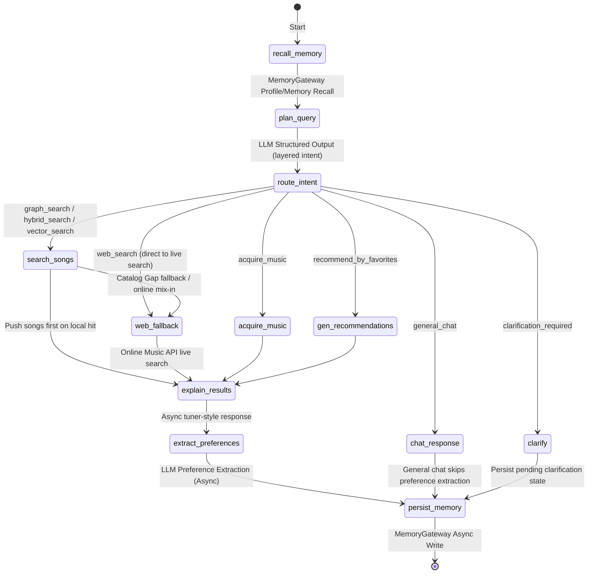

# 🎵 SoulTuner Agent

<p align="center">
  
</p>

<p align="center">
  <strong>Multimodal Music Recommendation Agent — Hybrid RAG × Knowledge Graph × Long-term Memory</strong>
</p>

<p align="center">
  
  
  
  
  
  
  <br/>
  
  
  
</p>

<p align="center">
  <a href="README.ch.md">中文</a> | <a href="README.md">English</a>
</p>

## 🎯 Discover Music with Natural Language, Let AI Truly Understand You

SoulTuner is a **locally-deployed** AI music recommendation agent. It's not just a simple "search → play" tool, but a personal DJ that **continuously learns your musical taste**:

- 🗣️ **Describe what you want to hear in natural language** — "I'm feeling really down today, I just want some quiet time alone." The system automatically identifies your emotion and scenario to recommend music that fits your current state.
- 🧠 **Understands you better the more you use it** — Every like, save, skip, and conversation silently builds your personalized music profile, making the next recommendation more accurate over time.
- 🌐 **Local library not enough? Real-time web search fallback** — The Catalog Gap Detector decides when local inventory or metadata is insufficient and supplements candidates online.
- 🗺️ **Immersive Music Journey** — Describe a story or scenario, and the AI will orchestrate a complete music journey with emotional arcs.
- ♻️ **Discover → Stage → Ingest** — Found a good song? It downloads to a "Pending" staging area first. Preview, then confirm ingestion with automatic acoustic analysis.

> 📖 For full features and interaction details, please refer to [Feature_Walkthrough.md](Feature_Walkthrough.md)
>
> Orchestrated via a LangGraph multi-node Agent workflow, integrating Neo4j, a MuQ-MuLan text-to-music anchor, M2D-CLAP / OMAR-RQ auxiliary representations, LLMs, and a MemoryGateway layer for multi-path retrieval, weighted RRF fusion, streaming recommendations, web fallback, music journeys, and a behavior data flywheel.

---

## 🖼️ Feature Preview

### 🏠 Home · 💬 Chat · 🎵 Recommend · 🎧 Player · 🗺️ Journey

<table>
  <tr>
    <td></td>
    <td></td>
  </tr>
  <tr>
    <td></td>
    <td></td>
  </tr>
  <tr>
    <td colspan="2"></td>
  </tr>
</table>

---

## 🚀 Quick Start

```powershell
# First enter the root folder of your cloned repository
cd <your-project-directory>
Copy-Item .env.example .env
notepad .env
```

The default model setup uses DashScope / Qwen. You can switch to another provider by changing `MAIN_LLM_PROVIDER` and `MODEL_NAME`, then filling the matching provider API key or service URL.

For the default setup, fill at least:

```env
MAIN_LLM_PROVIDER=dashscope
MODEL_NAME=qwen3.7-plus
DASHSCOPE_API_KEY=your DashScope key
NEO4J_PASSWORD=your Neo4j password
MUSIC_DATA_PATH=../data
```

For other providers such as SiliconFlow, Google, Volcengine, local SGLang, VLLM, or Ollama, change `MAIN_LLM_PROVIDER` and `MODEL_NAME`, then fill the corresponding key or endpoint in `.env.example`. You can also adjust model settings later from the frontend settings panel.

Then start the default GPU stack:

```powershell
.\soultuner.ps1 up gpu
```

Open `http://localhost:3003` after startup. To check service health:

```powershell
.\soultuner.ps1 doctor
```

If you do not have an NVIDIA GPU, or only want the lighter fallback mode, use:

```powershell
.\soultuner.ps1 up cpu
```

<details>
<summary>Other common commands</summary>

| Command | Purpose |
|---|---|
| `.\soultuner.ps1 down` | Stop all containers |
| `.\soultuner.ps1 logs` | Show service logs |
| `.\soultuner.ps1 test` | Run unit tests |
| `.\soultuner.ps1 ingest gpu` | Process pending songs with the GPU worker |
| `python scripts/dev/start_backend.py` | Start only the backend for local debugging |

</details>

---

## ✨ Core Features

| Feature | Description |
|---|---|
| 🔀 **Hybrid RAG** | Two content recall paths (graph / dense), weighted RRF fusion; personalization and long-tail exploration are post-recall score adjustments |
| 🎵 **Multimodal Text-to-Music** | MuQ-MuLan is the Chinese-strong primary recall model, M2D-CLAP is the fallback, and OMAR-RQ adds acoustic similarity |
| 🧠 **Long-term Memory** | MemoryGateway: Neo4j behavior hot path + optional GraphZep/Mem0 sidecars, with editable and clearable learned preferences |
| 📊 **Coarse Rank + Explore** | Graph Affinity coarse ranking cutoff + Thompson Sampling cold-start exploration slots |
| 🤖 **Smart Intent Recognition** | Layered intent plan: `hard_constraints / soft_intent / hints` + multi-turn inheritance |
| 👤 **User Profile** | Frontend visual profile panel (Genre/Emotion/Scenario/Language) → Neo4j hot path + long-term memory sidecars |
| 🌐 **Web Search Fallback** | Enabled by default; mixes a few online candidates when local results are healthy, and triggers SearxNG/Tavily/Zhipu discovery + Netease playable resolution when the catalog falls short |
| 🎼 **Music Journey** | LLM Story → Emotion breakdown → Step-by-step retrieval, real-time SSE streaming |
| ♻️ **Data Flywheel** | Download → Stage → Preview → Confirm Ingest → Ingest queue → Tag extraction → Vector encoding → Neo4j |
| 📋 **Library Mgmt** | Pending staging area + queue status/retry + My Library full-graph management (search/play/tag edit/delete) |
| 📡 **SSE Streaming** | Real-time frontend rendering: thinking process → song cards → recommendation reasons |
| 🐳 **Docker Deployment** | `docker compose up` one-click full-stack startup |

---

## 🏗️ System Architecture

```text
┌─────────────────────────────────────────────────────────────────────┐
│  Frontend (Next.js :3003)                                           │
│  React UI  ·  Global Audio Player  ·  Music Journey  ·  Settings   │
└──────────────────────────────┬──────────────────────────────────────┘
                               │ SSE
┌──────────────────────────────▼──────────────────────────────────────┐
│  Backend (FastAPI :8501)                                            │
│  SSE Streaming API  ·  Settings API  ·  Static Audio Server        │
└──────────────────────────────┬──────────────────────────────────────┘
                               │
┌──────────────────────────────▼──────────────────────────────────────┐
│  LangGraph Agent (StateGraph)                                       │
│                                                                     │
│  start → MemoryGateway Recall → Planner (LLM) → Intent Router     │
│                                                                     │
│     ┌─────────┬─────────┬─────────┬──────────┐                     │
│     ▼         ▼         ▼         ▼          ▼                     │
│  search_songs  chat  acquire  gen_reco  journey                    │
│     │                                                               │
│     ▼                                                               │
│  Hybrid Retrieval ──→ LLM Explainer ──→ Pref Extract ──→ MemoryGateway Write → end │
└──────────────────────────────┬──────────────────────────────────────┘
                               │
┌──────────────────────────────▼──────────────────────────────────────┐
│  Hybrid Retrieval Engine                                            │
│                                                                     │
│  GraphRAG · Dense KNN · Catalog Gap / Web Fallback                 │
│         └──────────────────┬───────────────────┘                   │
│                            ▼                                        │
│              Weighted RRF Fusion (keeps per-source ranks)            │
│                            ▼                                        │
│              Coarse Rank (Graph Affinity cutoff)                     │
│                            ▼                                        │
│              Thompson Sampling (cold-start exploration slots)        │
│                            ▼                                        │
│              Content-Anchor Rerank (Semantic+Acoustic normalized)   │
│                            ▼                                        │
│              MMR Multi-dim Diversity (λ=0.7)                       │
└─────────────────────────────────────────────────────────────────────┘
                               │
┌──────────────────────────────▼──────────────────────────────────────┐
│  Storage Layer                                                      │
│  Neo4j (Graph + Vectors + Memory Hot Path) · Optional Memory Sidecars │
└─────────────────────────────────────────────────────────────────────┘
```

### Tech Stack

| Layer | Technology |
|---|---|
| **Frontend** | Next.js 14 + React 18 |
| **Agent** | LangGraph StateGraph (layered intent planning + multi-recall routing) |
| **Backend** | FastAPI + SSE Streaming |
| **Graph Database** | Neo4j 5.x (Native Vector Index + Graph Relations + User Behavior direct-write) |
| **Audio Embeddings** | MuQ-MuLan (primary text-to-music, 512d) + M2D-CLAP (semantic fallback/rerank, 768d) + OMAR-RQ (acoustic auxiliary, 1024d) |
| **LLMs** | Default `dashscope / qwen3.7-plus`; other providers are advanced overrides |
| **Long-term Memory**| MemoryGateway (Neo4j hot path + optional GraphZep/Mem0 episodic sidecars) |
| **Web Search** | SearxNG federated search + Tavily + Zhipu WebSearch |
| **Ranking Algorithm**| Content-anchor rerank (Semantic+Acoustic) + bounded post-recall adjustments + Thompson Sampling + MMR |
| **Context Management**| GSSC Token budget pipeline (Gather/Select/Structure/Compress + async pre-compression) |
| **Containerization** | Docker Compose CPU/GPU entrypoints; CPU includes the full online stack, GPU adds the ingestion worker |

> 📖 See [tests/eval/README.md](tests/eval/README.md) for recommendation-quality and alignment evaluation commands.

---

## 🔬 Technical Notes

### RAG Hybrid Retrieval Pipeline

```text
User Query → Planner (LLM) outputs a layered plan
               ↓  hard_constraints + soft_intent + hints + intent_type
    ┌──────────┬──────────┐
    ▼          ▼
 GraphRAG   Dense KNN                    ← Step 1: two content recall paths
 (Neo4j)   (MuQ+OMAR)
    └──────────┴──────────┘
               ▼
   Step 2: Weighted RRF fusion            ← Preserves per-source rank and source metadata
               ▼
   Step 3: hard_constraints + DISLIKES    ← Only hard filter; mood/scenario/genre stay soft
               ▼
   Step 4: Artist Diversity Filter        ← ≤ N songs per artist (exception for specific queries)
               ▼
   Step 5: Post-recall Adjust + Explore  ← Personal/fresh/long-tail boosts, time-decayed exposure penalty
               ▼
   Step 6: Content-Anchor Normalized Rerank ← Primary text-to-music anchor(MuQ/M2D fallback) + seed acoustic anchor(OMAR-RQ)
               ▼
   Step 7: MMR Multi-dim Diversity + FinalCut
```

The retrieval layer treats explicit entities, language, and instrumental-only requests as hard constraints. Mood, scenario, vibe, and user preference stay as ranking signals. This keeps precise requests such as “only this artist” stable while avoiding empty results for softer requests such as “quiet, rainy, gentle”.

Recall source and rank metadata are preserved, so recommendation cards can explain whether a song came from graph search, vector search, or online fallback.

### Agent Workflow



### Memory And Feedback

MemoryGateway handles user profile, behavior feedback, and optional long-term memory sidecars. Neo4j stores structured events such as likes, saves, skips, and dislikes; GraphZep/Mem0 are optional extensions and do not block the main recommendation path.

Frontend profile settings, song feedback, and slate-level feedback can gradually affect ranking, but they do not override the relevance of the current query.

---

## 📁 Project Structure

```
.
├── agent/                      # LangGraph Agent
│   ├── music_agent.py          # Native agent loop
│   └── music_graph.py          # StateGraph workflow with layered intent routing
│
├── api/                        # FastAPI Interfaces
│   ├── server.py               # Gateway & Settings API
│   └── user_profile.py         # User Preferences API (GET/POST /api/user-profile)
│
├── config/settings.py          # Global Pydantic configs (Runtime patchable)
│
├── retrieval/                  # Engine abstractions
│   ├── hybrid_retrieval.py     # Multi-path Fusion + bounded adjustment/TS + Content-Anchor Rerank + MMR
│   ├── gssc_context_builder.py # GSSC pipeline (Budgeting + Abstract Context mapping)
│   ├── muq_embedder.py         # MuQ-MuLan audio/text encoder
│   ├── audio_embedder.py       # M2D-CLAP fallback and semantic rerank encoder
│   ├── neo4j_client.py         # Node connectivity definitions
│   ├── music_journey.py        # Journey architect algorithms
│   └── user_memory.py          # Neo4j Preferences & Logs
│
├── tools/                      # Tool executions
│   ├── graphrag_search.py      # Neo4j Cypher definitions
│   ├── semantic_search.py      # MuQ primary, M2D fallback, OMAR-assisted retrieval
│   ├── web_search_aggregator.py# SearxNG + Tavily routers
│   └── acquire_music.py        # Song acquisition and pending-ingest tools
│
├── llms/                       # LLMs
│   ├── prompts.py              # LLM Prompts
│   ├── registry.py             # Provider registry + env injection
│   ├── chat_models.py          # LangChain ChatModel factories
│   ├── native.py               # Native LiteLLM caller
│   └── multi_llm.py            # Backward-compatible facade
│
├── schemas/                    # Pydantic schemas
├── services/                   # Outer microservice bindings
├── data/pipeline/              # DB ingest pipelines
├── web/                        # Next.js Frontend
│   ├── components/Settings/    # ⚙️ Settings interface
│   ├── components/Profile/     # 👤 User Profile interface
│   └── components/Navigation/  # Nav layout views
│   └── app/library/            # Library pages (Pending / My Library / Likes / Collections)
│
├── graphzep_service/           # Optional GraphZep memory sidecar
├── deploy/legacy/              # Legacy single-service compose files
├── scripts/dev/                # Local step-by-step debug startup scripts
├── tests/                      # Testing & Eval
│   ├── unit/                   # Unit tests
│   └── eval/                   # Outcome eval harness (evaluate_outcomes.py)
├── .github/workflows/ci.yml    # GitHub Actions definitions
├── docker-compose.yml          # Container configuration
├── Dockerfile                  # API Engine definitions
├── pyproject.toml              # Ruff + Pytest syntax bounds
├── .env.example                # Templates
└── scripts/dev/start_backend.py # Backend local debug entrypoint
```

---

## ⚙️ Configuration

### Environment Variables

| Variable | Description |
| --- | --- |
| `DASHSCOPE_API_KEY` | Default DashScope / Qwen API key; fill the matching provider key if you switch providers |
| `NEO4J_PASSWORD` | Local Neo4j password |
| `MUSIC_DATA_PATH` | Folder for audio, cache, pending-ingest queue, and feedback logs |
| `MUSIC_WEB_SEARCH_ENABLED` | Whether online candidate fallback is allowed |
| `ADMIN_API_KEY` | Protects admin endpoints in shared or LAN deployments |
| `QDRANT_IMAGE` | Optional Qdrant image override for slow networks |

More advanced options are available in `.env.example`; normal usage does not require changing them one by one.

---

## 🙏 Acknowledgements

Architectural inspiration was expanded heavily upon [imagist13/Muisc-Research](https://github.com/imagist13/Muisc-Research).

| Project | Purpose |
|---|---|
| [aexy-io/graphzep](https://github.com/aexy-io/graphzep) | Core graph storage structure representations |
| [OpenMuQ/MuQ](https://github.com/OpenMuQ/MuQ) | MuQ-MuLan primary text-to-music model (CC-BY-NC 4.0) |
| [nttcslab/m2d](https://github.com/nttcslab/m2d) | M2D-CLAP fallback and auxiliary semantics |
| [MTG/omar](https://github.com/MTG/omar) | Raw acoustics implementations |

---

## 📚 References

1. Niizumi, D. et al. (2025). *M2D-CLAP: Exploring General-purpose Audio-Language Representations Beyond CLAP.*
2. Alonso-Jiménez, P. et al. (2025). *OMAR-RQ: Open Music Audio Representation Model Trained with Multi-Feature Masked Token Prediction.*
3. Rasmussen, P. et al. (2025). *Zep: A Temporal Knowledge Graph Architecture for Agent Memory.*
4. Palumbo, E. et al. (Spotify, 2025). *You Say Search, I Say Recs: A Scalable Agentic Approach to Query Understanding and Exploratory Search.* (RecSys 2025)
5. D'Amico, E. et al. (Spotify, 2025). *Deploying Semantic ID-based Generative Retrieval for Large-Scale Podcast Discovery at Spotify.*
6. Penha, G. et al. (2025). *Semantic IDs for Joint Generative Search and Recommendation.* (RecSys 2025 LBR)
7. Palumbo, E. et al. (2025). *Text2Tracks: Prompt-based Music Recommendation via Generative Retrieval.*
8. Xu, S. et al. (2025). *Climber: Toward Efficient Scaling Laws for Large Recommendation Models.*
9. Wang, S. et al. (2025). *Knowledge Graph Retrieval-Augmented Generation for LLM-based Recommendation.* (ACL 2025)

---

## 📄 License

MIT License

⚠️ **Disclaimer**: Produced and maintained solely for machine learning research applications and architectural experimentation limits. **Strictly NO commercial use**. Does not offer indexing mechanisms for commercialized data files.
