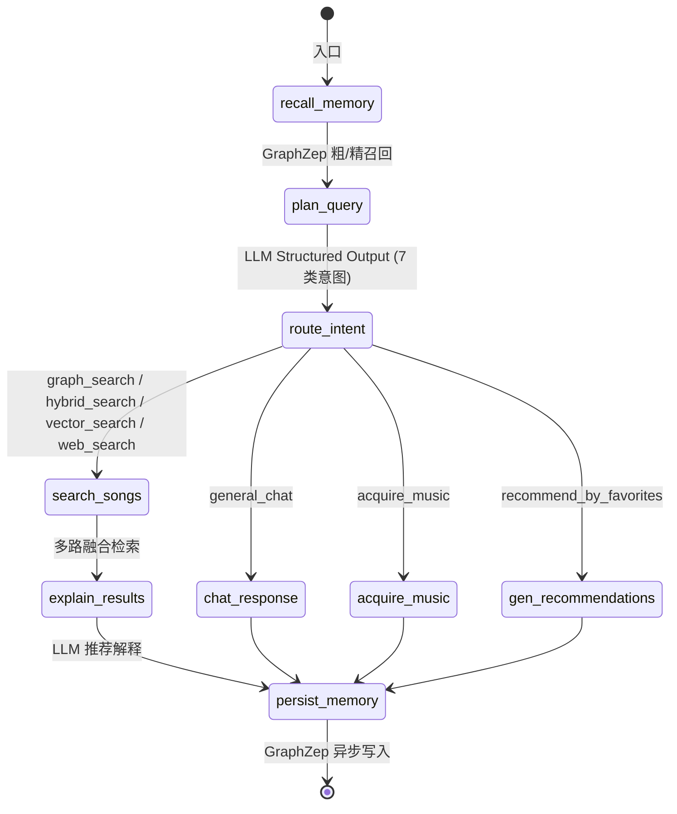
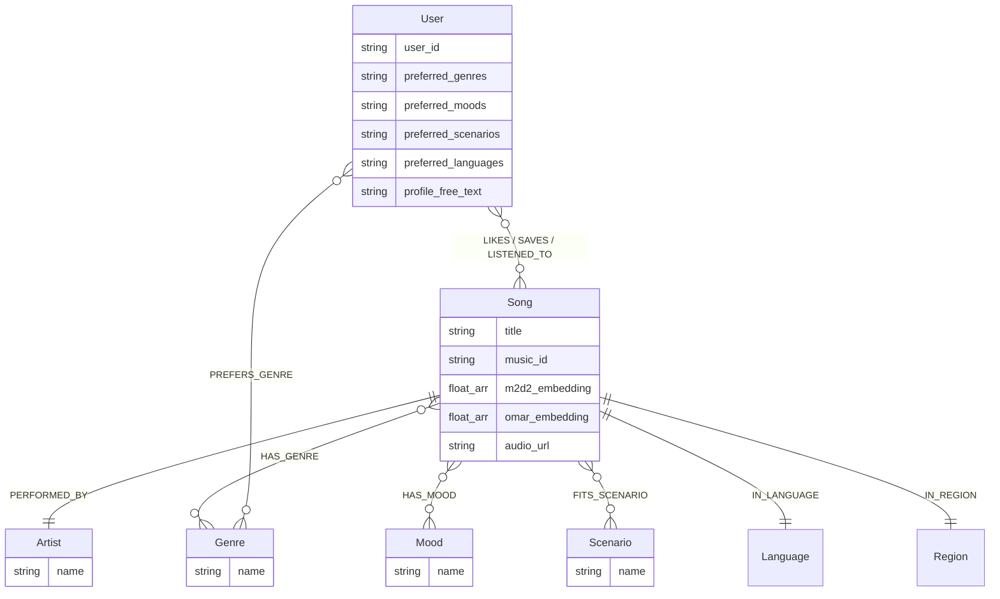

# 🎵 SoulTuner Agent

<p align="center">
  
</p>

<p align="center">
  <strong>多模态音乐推荐智能体 — Hybrid RAG × Knowledge Graph × Long-term Memory</strong>
</p>

<p align="center">
  
  
  
  
  
  
</p>

> 融合知识图谱（Neo4j）、双模型音频向量（M2D-CLAP + OMAR-RQ）、大语言模型和 GraphZep 长期记忆，通过 LangGraph 编排的多节点 Agent 工作流，实现多路混合检索、加权 RRF 融合、Neo4j 图距离加权、SSE 流式推荐、联网搜索回退、音乐旅程编排和用户行为数据飞轮。

---

## ✨ 核心特性

| 特性 | 说明 |
|------|------|
| 🔀 **Hybrid RAG** | GraphRAG + Semantic Search 并发检索，加权 RRF 融合排序 |
| 🎵 **双模型音频向量** | M2D-CLAP 跨模态语义 × 0.7 + OMAR-RQ 声学特征 × 0.3 |
| 🧠 **长期记忆** | GraphZep 双阶段召回，跨会话保留用户偏好 |
| 📊 **Graph Affinity** | Neo4j 图距离 + 用户画像偏好 Jaccard 双重个性化排序 |
| 🤖 **双套 Planner** | API 大模型融合版（意图+标签+HyDE 一次完成）/ 本地小模型精简版（HyDE 分离） |
| 👤 **用户画像** | 前端可视化画像面板，流派/情绪/场景/语言偏好 → Neo4j + GraphZep 双写 |
| 🌐 **联网搜索回退** | 本地库不足时自动触发 SearxNG 联邦搜索 + LLM 摘要 |
| 🎼 **音乐旅程** | LLM 故事→情绪拆解→逐段检索，SSE 实时推送 |
| ♻️ **数据飞轮** | 用户一键入库：搜索→发现→下载→标签提取→向量编码→Neo4j |
| 📡 **SSE 流式** | 前端实时渲染 thinking → 歌曲卡片 → 推荐理由 |
| ⚙️ **运行时配置** | 前端设置面板可实时调整 LLM、检索参数、RRF 权重 |
| 🐳 **Docker 部署** | `docker compose up` 一键启动全栈 |

---

## 🖼️ 功能预览

### 🏠 首页 · 💬 对话 · 🎵 推荐 · 🎧 播放 · 🗺️ 旅程

<table>
  <tr>
    <td></td>
    <td></td>
  </tr>
  <tr>
    <td></td>
    <td></td>
  </tr>
  <tr>
    <td colspan="2"></td>
  </tr>
</table>

---

## 🏗️ 系统架构

```
┌─────────────────────────────────────────────────────────────────────┐
│  Frontend (Next.js :3003)                                           │
│  React UI  ·  Global Audio Player  ·  Music Journey  ·  Settings   │
└──────────────────────────────┬──────────────────────────────────────┘
                               │ SSE
┌──────────────────────────────▼──────────────────────────────────────┐
│  Backend (FastAPI :8501)                                            │
│  SSE Streaming API  ·  Settings API  ·  Static Audio Server        │
└──────────────────────────────┬──────────────────────────────────────┘
                               │
┌──────────────────────────────▼──────────────────────────────────────┐
│  LangGraph Agent (StateGraph)                                       │
│                                                                     │
│  start → GraphZep Recall → Planner (LLM) → Intent Router          │
│                                                                     │
│     ┌─────────┬─────────┬─────────┬──────────┐                     │
│     ▼         ▼         ▼         ▼          ▼                     │
│  search_songs  chat  acquire  gen_reco  journey                    │
│     │                                                               │
│     ▼                                                               │
│  Hybrid Retrieval ──→ LLM Explainer ──→ GraphZep Write → end      │
└──────────────────────────────┬──────────────────────────────────────┘
                               │
┌──────────────────────────────▼──────────────────────────────────────┐
│  Hybrid Retrieval Engine                                            │
│                                                                     │
│  ┌─────────────┐  ┌──────────────────┐  ┌──────────────┐          │
│  │  GraphRAG   │  │  Semantic Search  │  │  Web Search  │          │
│  │  Neo4j      │  │  M2D-CLAP+OMAR   │  │  SearxNG     │          │
│  └──────┬──────┘  └────────┬─────────┘  └──────┬───────┘          │
│         └──────────────────┼───────────────────┘                   │
│                            ▼                                        │
│              Weighted RRF Fusion (α·Vector + β·Graph)              │
│                            ▼                                        │
│              Graph Affinity (图距离 + 画像 Jaccard 加分)             │
│                            ▼                                        │
│              Artist Diversity Filter (指定歌手豁免)                  │
│                            ▼                                        │
│              MMR Jaccard Rerank (λ=0.7)                            │
└─────────────────────────────────────────────────────────────────────┘
                               │
┌──────────────────────────────▼──────────────────────────────────────┐
│  Storage Layer                                                      │
│  Neo4j (Graph + Vectors)  ·  GraphZep Memory (:3100)               │
└─────────────────────────────────────────────────────────────────────┘
```

### 技术栈

| 层 | 技术 |
|---|---|
| **前端** | Next.js 14 + React 18 + Framer Motion |
| **Agent** | LangGraph StateGraph（7 意图路由） |
| **后端** | FastAPI + Uvicorn，SSE 流式推送，运行时设置 API |
| **图数据库** | Neo4j（原生向量索引 + 图谱关系） |
| **音频嵌入** | M2D-CLAP 2025（跨模态，768d）+ OMAR-RQ（声学，768d） |
| **大语言模型** | DeepSeek-V3.2 / 通义千问 / Gemini（可切换，支持本地微调模型） |
| **长期记忆** | GraphZep（Hono 微服务，双阶段召回） |
| **联网搜索** | SearxNG 联邦搜索 + Tavily + 智谱 WebSearch |
| **容器化** | Docker Compose（Neo4j + GraphZep + Backend + Frontend） |

---

## 🔬 技术深度

### 🤖 双套 Planner 架构（V3）

本系统针对不同 LLM 部署场景设计了两套 Planner Prompt，均使用简化后的 **7 类意图分类**（5 类检索策略 + 2 类功能性意图）：

```
意图类型：
  graph_search         — 有具体实体（歌手/歌名）或可精确匹配的流派/场景/语言/地区
  hybrid_search        — 有具体实体 + 无法用标签穷举的主观声学描述
  vector_search        — 纯情绪/氛围/画面感，无任何可匹配实体
  web_search           — 时效性内容或用户明确要求联网
  general_chat         — 闲聊
  acquire_music        — 确认下载/获取推荐歌曲（功能性）
  recommend_by_favorites — 查看用户收藏/点赞（功能性）
```

#### 方案 A：API 大模型融合版（`UNIFIED_MUSIC_QUERY_PLANNER_PROMPT`）

适用于 DeepSeek / Claude / GPT 等云端大模型。**一次 LLM 调用**同时完成：

| 输出字段 | 内容 |
|---------|------|
| `intent_type` | 7 类意图之一 |
| `parameters.entities` | 提取的歌手名、歌曲名（含中外文别名） |
| `graph_*_filter` | 流派/情绪/场景/语言/地区五维标签 |
| `vector_acoustic_query` | **内联 HyDE**：直接生成英文声学描述（仅 hybrid/vector 时填写） |

优点：省掉第二次专用 HyDE LLM 调用，总延迟降低约 30-50%。

#### 方案 B：本地小模型精简版（`LOCAL_PLANNER_PROMPT`）

适用于 SGLang / vLLM / Ollama 部署的 Qwen3-4B 等本地模型。以 `/no_think` 前缀关闭思维链，**只输出意图分类 + 实体提取 + 标签**，`vector_acoustic_query` 留空。

HyDE 声学描述由下游 `retrieval/hybrid_retrieval.py` 中的 `_generate_hyde_description()` 独立生成（调用独立 HyDE 专用 prompt `HYDE_ACOUSTIC_GENERATOR_PROMPT`）。

#### 双模式 HyDE 分支逻辑（`hybrid_retrieval.py`）

```python
if use_vector:
    vector_acoustic_query = precomputed_plan.get("vector_acoustic_query", "")
    if vector_acoustic_query:
        # API 模式：LLM 已内联生成，直接使用
        vector_desc = vector_acoustic_query
    else:
        # 本地模式：调用独立 HyDE 模块生成
        vector_desc = self._generate_hyde_description(query, graphzep_facts, intent_type)
```

### RAG 混合检索流水线

```
用户查询 → Planner (LLM)
              ↓  intent_type + retrieval_plan
   ┌──────────┼──────────┐
   ▼          ▼          ▼
GraphRAG   VectorKNN  WebSearch
(Cypher)  (M2D+OMAR) (SearxNG)
   └──────────┼──────────┘
              ▼
  加权 RRF 融合 (α·向量 + β·图谱，前端可调)
              ▼
  Graph Affinity 双重加分:
    Step A: Neo4j shortestPath 图距离 1/(1+d)
    Step B: 用户画像偏好 Jaccard 相似度 × 0.3
              ▼
  Artist 多样性过滤 (每歌手≤3首，指定歌手豁免)
              ▼
  MMR Jaccard 多样性重排 (λ=0.7)
              ▼
         Top-K 结果
```

**关键设计决策**：

- **GraphRAG**：五维标签过滤（genre / scenario / mood / language / region），200+ 中英文别名映射
- **双模型向量**：M2D-CLAP 跨模态语义 + OMAR-RQ 纯声学，三阶段流水线融合
- **Cross-Encoder 精排**：已关闭（`reranker_enabled = False`）。对短标签歌曲文档场景提升有限，RRF + Graph Affinity 已足够，保留接口供未来评估后启用
- **RRF 加权**：向量/图谱权重前端可调，避免单一通道主导
- **MMR Jaccard**：利用候选歌的 `{genre, mood}` 标签集合计算 Jaccard 相似度实现流派级多样性重排，无需向量

### Agent 工作流



> **注意**：旧版 `play_specific_song_online`（在线播放指定歌曲）意图已移除。用户搜索具体歌曲时统一走 `graph_search → search_songs` 路径，在本地库中查找；如未命中，由 LLM Explainer 提示用户通过数据飞轮入库。

### 记忆系统

| 组件 | 说明 |
|------|------|
| **GraphZep 双阶段** | Stage 1 粗召回 20 条 → Stage 2 精排 5 条（相似度+时间衰减） |
| **GSSC Token 预算** | facts + chat_history 在 3000 token 内动态分配 |
| **Neo4j 偏好图谱** | 每轮对话 LLM 提取用户偏好，fire-and-forget 写入 User 节点 |
| **用户画像双写** | 前端画像面板保存 → 同时写入 Neo4j User 属性 + GraphZep 长期记忆 |

### 用户画像系统

```text
前端画像面板 (UserProfilePanel)
       ↓ POST /api/user-profile
  ┌────┴────┐
  ▼         ▼
Neo4j      GraphZep
User节点    长期记忆
(JSON属性)  (自然语言事件)
  │         │
  └──→ Graph Affinity 读取偏好 ←──┘
       Jaccard(user_pref, song_tags)
       → 候选歌排序加分
```

### 数据飞轮

用户搜索 → 发现新歌 → 一键"加入本地" → 下载音频/封面/歌词 → LLM 标签提取 + 双模型向量编码 → Neo4j 入库 → 下次检索可命中

---

## 📊 Neo4j 知识图谱



**向量索引**：`song_m2d2_index`（768d, cosine）+ `song_omar_index`（768d, cosine）

---

## 🚀 快速开始

### 方式一：Docker Compose（推荐）

```bash
# 1. 复制并配置环境变量
cp .env.example .env
# 编辑 .env 填入 API Key

# 2. 一键启动
docker compose up -d

# 3. 访问
# 前端: http://localhost:3003
# 后端: http://localhost:8501
# Neo4j: http://localhost:7474
```

### 方式二：本地开发（Conda）

```bash
# 环境准备
conda create -n music_agent python=3.11
conda activate music_agent
pip install -r requirements.txt
cd web && npm install && cd ..

# 一键启动所有服务
python startup_all.py

# 或前后端分离开发
conda activate music_agent; python startup_all.py --no-web    # 终端 A：后端
cd web && npm run dev             # 终端 B：前端（热更新）
```

### 方式三：本地大模型微调部署（WSL + SGLang）

针对 8GB 显存（如 RTX 4070）设备的优化部署方案，支持跑满 4B 级别的本地微调大模型（如 `Qwen-4B`）同时保留显存给跨模态检索系统。

**前置要求**：

1. Windows 开启 WSL2 (Ubuntu)
2. WSL 内部安装好 CUDA Toolkit (仅需 `nvcc`)
3. 在 WSL 内的虚拟环境中安装 `sglang[all]`

**启动步骤**：

1. **终端A (WSL)**：启动大模型推理引擎

   ```bash
   wsl
   bash /mnt/c/Users/sanyang/sanyangworkspace/music_recommendation/Muisc-Research/scripts/start_sglang.sh
   ```

   *内置显存切分逻辑：大模型 FP8 在线量化锁定 70% 显存 (~5.5GB)，预留充足空间给音频向量模型。*

2. **终端B (Windows)**：在前端设置面板切换为本地模型
   - 正常运行 `python startup_all.py`
   - 打开系统设置 ⚙️
   - **主提供商**：选择 `sglang`
   - **Base URL**：填入 `http://localhost:8000/v1`
   - 保存设置，系统即会自动切换为本地 4B 模型，使用精简版 Planner

> ⚠️ 启动前需先打开 Neo4j Desktop 并启动数据库。

<details>
<summary>手动分步启动</summary>

| 终端 | 命令 | 端口 |
|------|------|------|
| 0 | Neo4j Desktop 启动数据库 | `:7687` |
| 1 | `cd graphzep_service/server && npm run dev` | `:3100` |
| 2 | `python start.py --mode api` | `:8501` |
| 3 | `cd web && npm run dev` | `:3003` |
| 4 | `docker compose -f docker-compose.searxng.yml up -d` | `:8888` |

</details>

<details>
<summary>前置服务安装</summary>

**SearxNG 联网搜索**

```bash
docker compose -f docker-compose.searxng.yml up -d  # :8888
```

</details>

---

## 📁 项目结构

```
.
├── agent/                      # LangGraph Agent
│   ├── music_agent.py          # Agent 主入口
│   └── music_graph.py          # StateGraph 工作流（7 意图路由）
│
├── api/                        # FastAPI 接口层
│   ├── server.py               # 主服务 + Settings API
│   └── user_profile.py         # 用户画像 API（GET/POST /api/user-profile）
│
├── config/settings.py          # 全局配置（支持运行时修改）
│                               # reranker_enabled = False（Cross-Encoder 已关闭）
│
├── retrieval/                  # 检索引擎层
│   ├── hybrid_retrieval.py     # 多路融合 + RRF + Graph Affinity + MMR
│   │                           # 内置双模式 HyDE 分支（API内联 / 本地独立生成）
│   ├── audio_embedder.py       # M2D-CLAP 跨模态编码
│   ├── neo4j_client.py         # Neo4j 连接封装
│   ├── music_journey.py        # 音乐旅程编排器
│   └── user_memory.py          # 用户偏好 Neo4j 记忆
│
├── tools/                      # 工具层
│   ├── graphrag_search.py      # 知识图谱检索（Neo4j Cypher，五维标签）
│   ├── semantic_search.py      # 向量检索（M2D-CLAP + OMAR）
│   ├── web_search_aggregator.py # 联网搜索聚合（SearxNG + Tavily）
│   └── acquire_music.py        # 数据飞轮（下载入库）
│
├── llms/                       # LLM 接口 + Prompts
│   ├── prompts.py              # 双套 Planner（融合版 + 精简版）+ 5 个辅助 Prompt
│   └── multi_llm.py            # 多提供商 LLM 工厂
│
├── schemas/                    # Pydantic 数据模型
│   └── query_plan.py           # MusicQueryPlan + RetrievalPlan（含 vector_acoustic_query）
│
├── services/                   # 外部服务客户端（GraphZep）
│
├── data/pipeline/              # 数据管线
│   ├── ingest_to_neo4j.py      # Neo4j 入库
│   ├── neo4j_schema_v2.py      # 数据集管理 CLI（list/verify/backfill）
│   └── lyrics_analyzer.py      # LLM 歌词标签分析
│
├── web/                        # Next.js 前端
│   ├── components/Settings/    # ⚙️ 运行时设置面板
│   ├── components/Profile/     # 👤 用户画像面板
│   └── components/Navigation/  # 导航、侧边栏
│
├── graphzep_service/           # GraphZep 微服务
├── docker-compose.yml          # Docker 全栈编排
├── Dockerfile                  # 后端镜像
├── .env.example                # 环境变量模板
├── startup_all.py              # 本地一键启动器
└── requirements.txt            # Python 依赖
```

---

## 🔧 数据管线

首次部署或新增音乐时执行：

```bash
# 1. 歌词标签提取（LLM 自动化）
python data/pipeline/lyrics_analyzer.py

# 2. 入库 Neo4j
python data/pipeline/ingest_to_neo4j.py              # 完整入库
python data/pipeline/ingest_to_neo4j.py --skip-embeddings   # 仅元数据
python data/pipeline/ingest_to_neo4j.py --update-embeddings # 仅补充向量
```

### 数据集管理 CLI

```bash
# 查看各数据集歌曲分布
python data/pipeline/neo4j_schema_v2.py --list-datasets

# 验证向量索引状态
python data/pipeline/neo4j_schema_v2.py --verify

# 回填缺失的 dataset 标签
python data/pipeline/neo4j_schema_v2.py --backfill
```

---

## ⚙️ 配置

### 环境变量

| 变量 | 说明 | 默认值 |
|------|------|--------|
| `OPENAI_BASE_URL` | LLM API 地址 | `https://api.siliconflow.cn/v1` |
| `OPENAI_API_KEY` | LLM API 密钥 | — |
| `MODEL_NAME` | 主推理模型 | `deepseek-ai/DeepSeek-V3` |
| `NEO4J_URI` | Neo4j 连接 | `neo4j://127.0.0.1:7687` |
| `NEO4J_PASSWORD` | Neo4j 密码 | — |
| `TAVILY_API_KEY` | 联网搜索 | 可选 |
| `GOOGLE_API_KEY` | Gemini API | 可选 |

### 运行时设置（前端）

前端设置面板（⚙️ 系统设置）支持实时调整：

| 分类 | 可调参数 |
|------|----------|
| **模型配置** | 主 LLM 提供商/模型、意图分析模型、使用本地模型开关、超时 |
| **检索参数** | 图谱/向量/歌单数量、RRF 权重、图距离加权开关/权重/跳数 |
| **音乐数据** | 本地音乐/MTG/联网获取/模型导出目录 |
| **记忆系统** | 上下文保留轮数、用户 ID |

修改后点击保存即时生效，关闭面板则丢弃未保存修改。支持「↩ 还原默认」。

---

## 🔌 API 端点

### SSE 流式

| 端点 | 说明 |
|------|------|
| `POST /api/recommendations/stream` | 音乐推荐（流式） |
| `POST /api/journey/stream` | 音乐旅程（流式） |

### REST

| 端点 | 说明 |
|------|------|
| `POST /api/search` | 歌曲搜索 |
| `POST /api/acquire-song` | 加入本地曲库 |
| `POST /api/user-event` | 用户行为上报（LIKES/SAVES/LISTENED_TO） |
| `GET /api/user-profile` | 读取用户画像偏好 |
| `POST /api/user-profile` | 保存用户画像偏好 → Neo4j + GraphZep |
| `GET /api/settings` | 获取当前配置 |
| `POST /api/settings` | 更新配置 |
| `POST /api/settings/reset` | 还原默认配置 |
| `GET /health` | 健康检查 |

---

## 🙏 致谢

本项目初始架构参考自 [imagist13/Muisc-Research](https://github.com/imagist13/Muisc-Research)，在此基础上进行了大规模重构与功能扩展。

| 项目 | 用途 |
|------|------|
| [aexy-io/graphzep](https://github.com/aexy-io/graphzep) | GraphZep 长期记忆 |
| [nttcslab/m2d](https://github.com/nttcslab/m2d) | M2D-CLAP 跨模态模型 |
| [MTG/omar](https://github.com/MTG/omar) | OMAR-RQ 音频模型 |
| [langchain-ai/langgraph](https://github.com/langchain-ai/langgraph) | Agent 编排 |
| [searxng/searxng](https://github.com/searxng/searxng) | 联网元搜索 |

---

## 📄 许可证

MIT License

⚠️ **免责声明**：本项目仅供学习与架构研究，**严禁商业用途**。不提供、不包含也不分发任何受版权保护的音频或歌词资源。音频数据需用户自行通过合法渠道获取。
