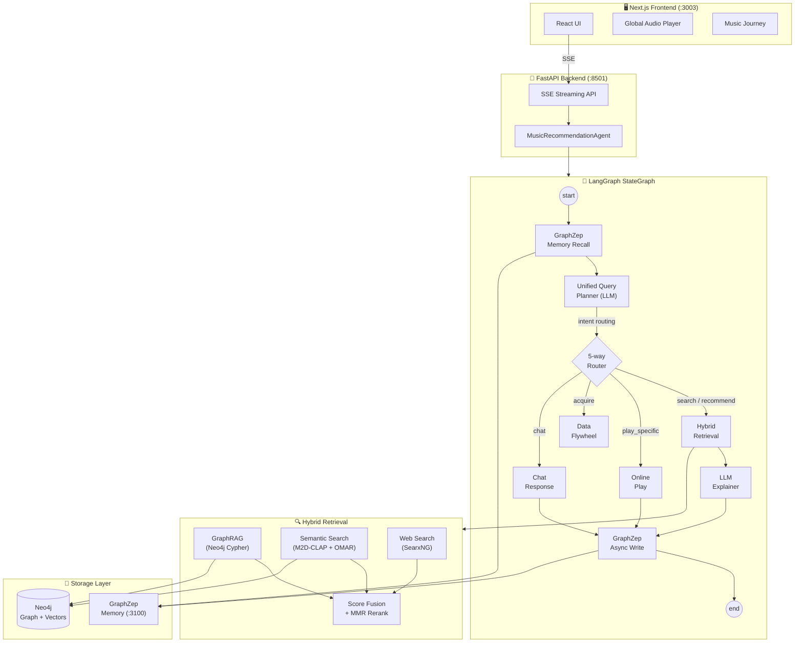
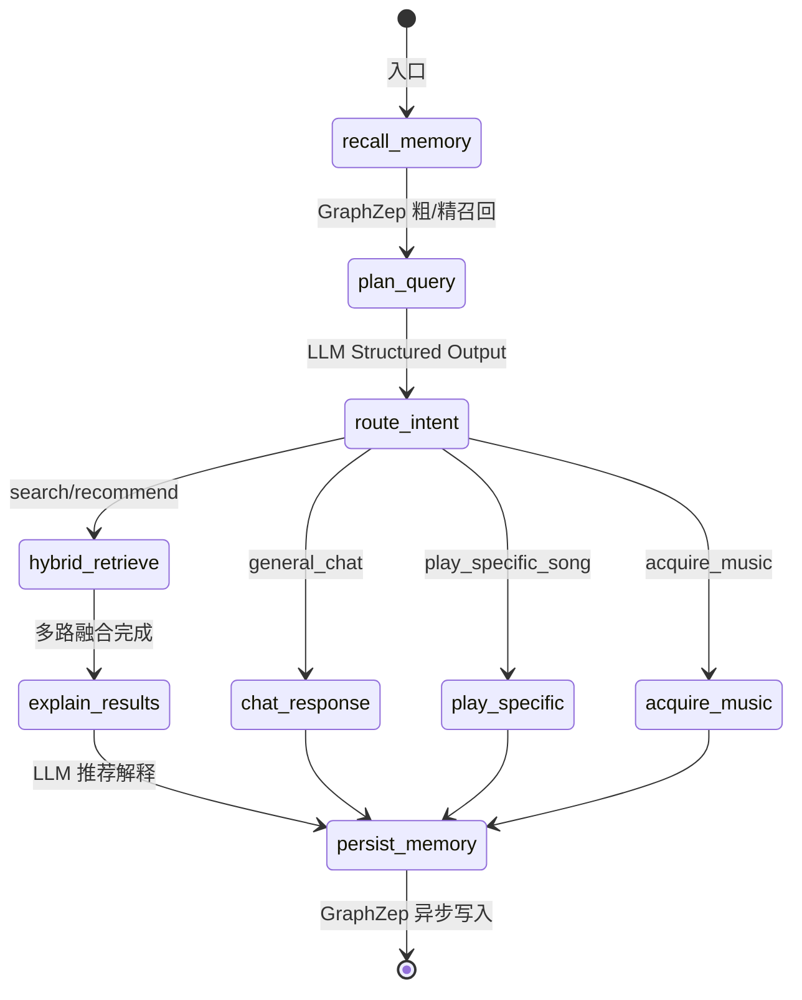
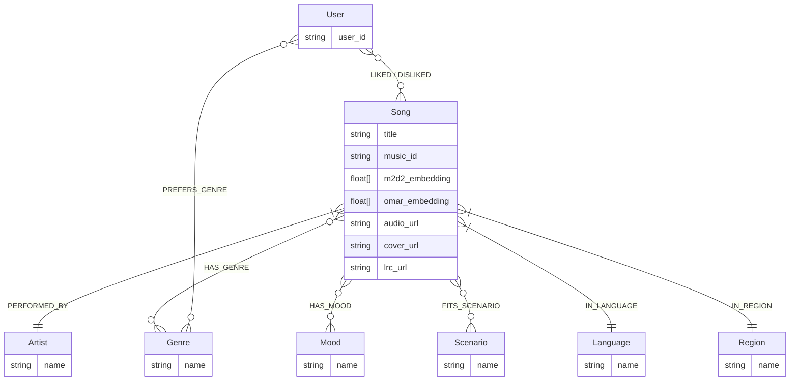
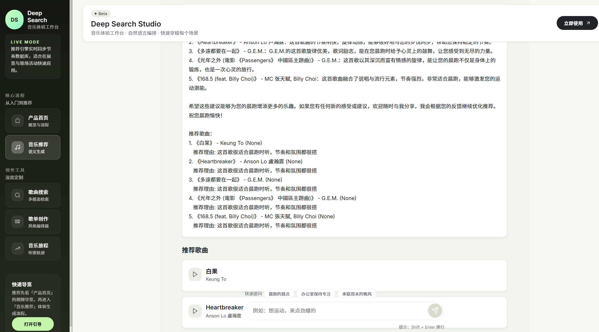
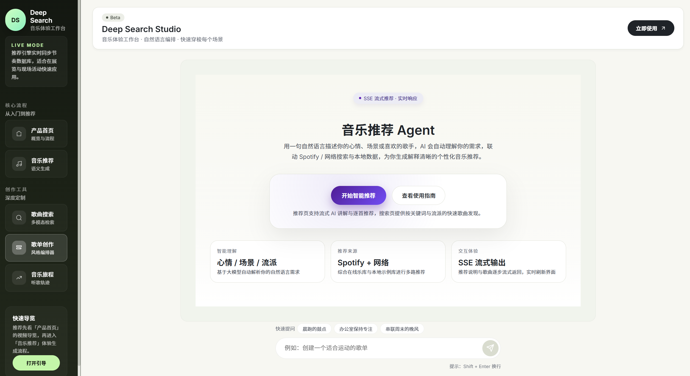
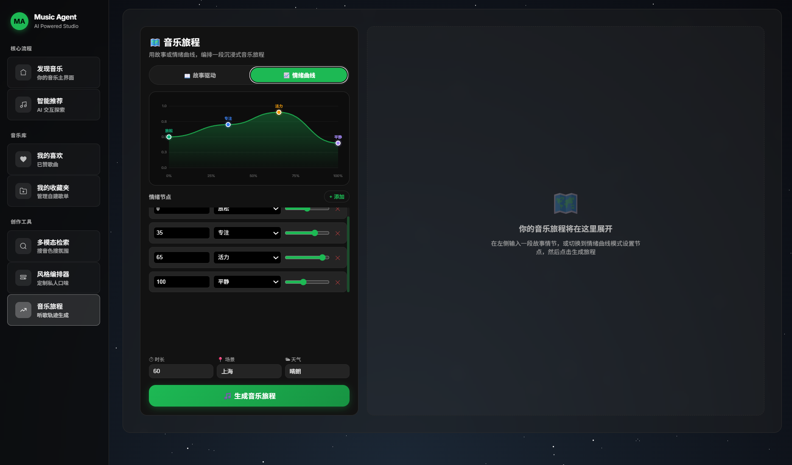

# 🎵 AI Music Recommendation Agent

<p align="center">
  
</p>

<p align="center">
  <strong>多模态音乐推荐智能体 — Hybrid RAG × Knowledge Graph × Long-term Memory</strong>
</p>

<p align="center">
  
  
  
  
  
</p>

> 融合知识图谱（Neo4j）、双模型音频向量（M2D-CLAP + OMAR-RQ）、大语言模型（DeepSeek-V3）和 GraphZep 长期记忆，通过 LangGraph 编排的 11 节点 Agent 工作流，实现多路混合检索、SSE 流式推荐、联网搜索回退、音乐旅程编排和用户行为数据飞轮。


---

## ✨ 核心特性

| 特性 | 说明 |
|---|---|
| 🔀 **混合 RAG 检索** | GraphRAG（知识图谱精确匹配） + Semantic Search（M2D-CLAP 向量 KNN）并发执行，加权融合排序 |
| 🎵 **双模型向量融合** | M2D-CLAP 跨模态语义匹配 × 0.7 + OMAR-RQ 纯声学特征 × 0.3，三阶段流水线 |
| 🧠 **长期记忆** | GraphZep 双阶段记忆召回（粗→精），跨会话保留用户偏好 |
| 🌐 **联网搜索回退** | 本地数据库不足时自动触发 SearxNG 联邦搜索 + LLM 信息提取 |
| 🎼 **音乐旅程编排** | LLM 驱动的故事→情绪拆解→逐段检索，SSE 实时推送 |
| ♻️ **数据飞轮** | 用户一键将搜索发现的歌曲下载入库 Neo4j，形成"搜索→发现→入库→再检索"闭环 |
| 🏷️ **200+ 标签映射** | genre / scenario / mood / language / region 五维度中英文映射表 |
| 📡 **SSE 流式推荐** | 前端实时接收 thinking → 歌曲 → 推荐理由，逐条渲染 |

---

## 🏗️ 系统架构

### 整体架构



### 技术栈

| 层 | 技术 |
|---|---|
| **前端** | Next.js 14 + React 18 + Framer Motion |
| **Agent 框架** | LangGraph StateGraph（11 节点 + 5 条件路由） |
| **后端 API** | FastAPI + Uvicorn，SSE 流式推送 |
| **图数据库** | Neo4j（原生向量索引 + 图谱关系） |
| **音频嵌入** | M2D-CLAP 2025（跨模态，768d）+ OMAR-RQ（声学，768d） |
| **大语言模型** | DeepSeek-V3 via SiliconFlow（可配置 Gemini / GLM-4） |
| **长期记忆** | GraphZep（Hono 微服务，自研双阶段召回） |
| **联网搜索** | SearxNG 自建元搜索 + Tavily API + 智谱 WebSearch |
| **音乐数据源** | NeteaseCloudMusicApi（本地代理） |

---

## 🔬 技术深度解析

### RAG 混合检索架构

本系统采用**三路并发 + 加权融合 + MMR 重排序**的混合检索架构：

```
用户查询 → Unified Query Planner (LLM Structured Output)
                    ↓
        ┌──────────┼──────────┐
        ▼          ▼          ▼
   GraphRAG    VectorKNN   WebSearch
  (Neo4j Cypher) (M2D+OMAR) (SearxNG)
        └──────────┼──────────┘
                   ▼
          Score Fusion (0.7 × vector + 0.3 × graph)
                   ▼
          MMR Rerank (λ=0.7, genre-aware)
                   ▼
              Top-K Results
```

**GraphRAG 知识图谱检索**

- 五维度标签过滤：`genre` / `scenario` / `mood` / `language` / `region`
- 200+ 中英文别名映射（如 "摇滚" → `rock`、"伤感" → `悲伤`）
- 精确实体匹配（歌手名中英文双查）+ 模糊 Cypher 查询

**双模型向量融合（M2D-CLAP + OMAR-RQ）**

- **M2D-CLAP 2025**（768d）：文本→音频**跨模态**语义匹配，将自然语言描述（"安静的雨夜钢琴曲"）直接映射到音频嵌入空间
- **OMAR-RQ multicodebook**（768d）：纯**声学特征**匹配，捕捉乐器、节奏、调性等底层音频属性
- 三阶段流水线：`M2D KNN(50首) → OMAR 质心距离重排 → 加权融合(0.7:0.3)`

**HyDE（Hypothetical Document Embedding）**

- 统一查询规划器中，LLM 为每个查询生成 80-120 词的**英文声学描述**
- 7 种情形自适应：模糊情绪 / 明确乐器 / 场景驱动 / 歌手混合 / 精确查询 / 文化风格 / 否定式
- 声学描述直接作为 M2D-CLAP 文本输入，无需二次编码

**MMR 多样性重排序**

- `λ=0.7` 的 genre-aware MMR，防止同一流派/艺术家垄断 Top-K
- 公式：`MMR(d) = λ · Sim(d, q) − (1−λ) · max{Sim(d, d') | d' ∈ Selected}`

---

### Agent 构建方法

**LangGraph StateGraph 工作流**

11 个节点 + 5 个条件路由边，实现完整的 Agent 管线：



**统一查询规划器（Unified Query Planner）**

- 用 `llm.with_structured_output(MusicQueryPlan)` **一次 LLM 调用**同时完成：
  - 意图识别（9 种意图类型）
  - 检索路由规划（Graph/Vector/Web 开关）
  - 过滤参数提取（genre/mood/scenario/language/region）
  - HyDE 声学描述生成（80-120 词英文）
- 避免传统多轮 LLM 调用的延迟和成本

**确定性后处理兜底**

- LLM 漏填的过滤字段通过首字典扫描用户原文自动补充
- 如 "来点运动听的" → LLM 忘填 `graph_scenario_filter` → 后处理检测到 "运动" → 自动填入

---

### 记忆系统

**GraphZep 双阶段记忆**

1. **Stage 1 粗召回**（20 条）：基于用户 ID 检索历史记忆节点
2. **Stage 2 精排**（5 条）：结合当前查询上下文、相似度和时间衰减选取最相关记忆

**GSSC Token 预算管理**

- 将 `graphzep_facts` + `chat_history` 在固定 token 预算（3000）内动态分配
- 优先保证近期对话上下文，剩余预算分配给长期记忆

**Neo4j 用户偏好图谱**

- 从每轮对话中通过 LLM 提取用户偏好（场景偏好 + 全局偏好）
- fire-and-forget 异步写入 Neo4j `User` 节点，不阻塞主流程

---

### 数据飞轮 (Data Flywheel)

```
                    ┌─→ 入库 Neo4j ─→ GraphRAG 可检索 ─┐
                    │                                   │
用户搜索 → 发现歌曲 → 一键"加入本地" → NeteaseApi下载     │
                                        ↓              │
                                  音频/封面/歌词         │
                                        ↓              │
                                LLM 标签提取+向量编码     │
                                        ↓              │
                                   Neo4j 入库 ──────────┘
```

---

### 音乐旅程编排 (Music Journey)

两阶段管线：

1. **LLM Structured Output** → `MusicJourneyPlan`（故事理解 + 情绪拆解为 3-6 段）
2. **逐段并发检索** → 实时 SSE 推送歌曲（每首歌约 4 分钟）

支持两种输入模式：

- **故事驱动**：自然语言描述（如 "城市夜跑 → 河边散步 → 回家休息"）
- **情绪曲线**：手动拖拽情绪节点（mood + intensity + time）

---

## 📊 Neo4j 知识图谱 Schema



**向量索引**：

- `song_m2d2_index`（768d，cosine）— M2D-CLAP 跨模态嵌入
- `song_omar_index`（768d，cosine）— OMAR-RQ 声学嵌入

---

## 🖼️ 功能截图

| 首页 | 音乐推荐 |
|:---:|:---:|
|  |  |

| 歌曲搜索 | 歌单创作 |
|:---:|:---:|
|  |  |

| 音乐旅程 |
|:---:|
|  |

---

## 🚀 快速开始

### 环境要求

- **Python** 3.11+（推荐 Conda）
- **Node.js** 18+（前端 & GraphZep）
- **Neo4j Desktop**（本地图数据库）
- **Docker**（可选，SearxNG 联网搜索）

### 一键启动（推荐）

```bash
conda activate music_agent
python startup_all.py
```

自动启动：🎵 NeteaseAPI (`:3000`) · 🔧 FastAPI (`:8501`) · 🔍 SearxNG (`:8888`) · 🧠 GraphZep (`:3100`) · 🖥️ Next.js (`:3003`)

按 `Ctrl+C` 统一关闭。

### 推荐开发工作流（前后端分离）

```bash
# 终端 A：所有后端服务
conda activate music_agent
python startup_all.py --no-web

# 终端 B：前端（Next.js 秒级热更新）
cd web && npm run dev
cd web ; npm run dev
```

可选参数：`--no-docker` · `--no-web` · `--no-graphzep` · `--no-netease`

> **前置条件**：启动前需先打开 Neo4j Desktop 并启动数据库。

### 手动分步启动

<details>
<summary>展开查看分步说明</summary>

#### 1. 环境准备

```bash
conda create -n music_agent python=3.11
conda activate music_agent
pip install -r requirements.txt
cd web && npm install && cd ..
cd graphzep_service/server && npm install && cd ../..
```

#### 2. 配置 `.env`

```env
OPENAI_BASE_URL=https://api.siliconflow.cn/v1
OPENAI_API_KEY=sk-your_key
MODEL_NAME=deepseek-ai/DeepSeek-V3
NEO4J_URI=neo4j://127.0.0.1:7687
NEO4J_USER=neo4j
NEO4J_PASSWORD=your_password
TAVILY_API_KEY=your_tavily_key    # 可选
PORT=3100                          # GraphZep
```

#### 3. 启动各服务

| 终端 | 命令 | 端口 |
|---|---|---|
| 0 | Neo4j Desktop 启动数据库 | `:7687` |
| 1 | `cd graphzep_service/server && npm run dev` | `:3100` |
| 2 | `python start.py --mode api` | `:8501` |
| 3 | `cd web && npm run dev` | `:3003` |
| 4 | `docker-compose -f docker-compose.searxng.yml up -d` | `:8888` |

</details>

---

### 前置服务安装

<details>
<summary>NeteaseCloudMusicApi（首次安装）</summary>

> 社区维护的复活增强版：[NeteaseCloudMusicApiEnhanced/api-enhanced](https://github.com/NeteaseCloudMusicApiEnhanced/api-enhanced)，本机运行，完全免费。

```bash
git clone --depth 1 https://github.com/NeteaseCloudMusicApiEnhanced/api-enhanced.git NeteaseCloudMusicApi
cd NeteaseCloudMusicApi && npm install
```

启动：`npm start`（监听 `:3000`）

</details>

<details>
<summary>SearxNG 联网搜索（Docker，首次安装）</summary>

```bash
docker-compose -f docker-compose.searxng.yml up -d
```

访问 `http://localhost:8888` 确认成功。

</details>

---

## 📁 项目结构

```
.
├── music_agent.py              # Agent 主入口
├── startup_all.py              # 一键统一启动器（推荐）
├── start.py                    # 轻量单模块启动器
│
├── api/                        # FastAPI 路由与 SSE 端点
│   └── server.py               # 主服务（含静态音频挂载）
│
├── graphs/                     # LangGraph 工作流定义
│   └── music_graph.py          # 11 节点 StateGraph
│
├── tools/                      # 检索工具层
│   ├── graphrag_search.py      # 知识图谱检索（Neo4j Cypher）
│   ├── semantic_search.py      # M2D-CLAP + OMAR 向量检索
│   └── web_search_aggregator.py # 联网搜索聚合
│
├── rag/                        # 底层编码器 & 数据库客户端
│   ├── audio_embedder.py       # M2D-CLAP 跨模态编码
│   └── neo4j_client.py         # Neo4j 连接封装
│
├── rag_modules/                # 上层检索逻辑
│   ├── music_hybrid_retrieval.py # 多路检索融合 + MMR
│   ├── music_journey.py        # 音乐旅程编排器
│   └── user_memory.py          # 用户偏好 Neo4j 记忆
│
├── schemas/                    # Pydantic 数据模型
│   ├── query_plan.py           # MusicQueryPlan（LLM 输出）
│   └── journey_plan.py         # MusicJourneyPlan
│
├── prompts/                    # LLM 提示模板
│   └── music_prompts.py        # Planner / Explainer / Chat / Memory / Journey
│
├── services/                   # 外部服务客户端
│   └── graphzep_client.py      # GraphZep HTTP 客户端
│
├── graphzep_service/           # GraphZep 微服务（Node.js + Hono）
│   └── server/                 # 服务器源码
│
├── data_pipeline/              # 数据处理与入库
│   ├── ncm_pipeline.py         # 网易云下载管道
│   ├── lyrics_analyzer.py      # LLM 歌词标签分析
│   ├── ingest_to_neo4j.py      # Neo4j 入库（元数据+向量）
│   └── neo4j_schema_v2.py      # 向量索引初始化
│
├── config/                     # 配置与日志
├── context/                    # 对话历史管理
├── llms/                       # LLM 接口封装
│
├── web/                        # Next.js 前端 (:3003)
│   ├── app/                    # 页面路由
│   ├── components/             # UI 组件
│   ├── context/                # React Context（PlayerContext 等）
│   └── lib/                    # API 客户端
│
├── assets/                     # 截图等静态资源
├── .env                        # 环境变量（勿提交）
└── requirements.txt            # Python 依赖
```

---

## 🔧 数据管线

首次部署或新增音乐时执行：

```bash
# 1. 下载音频和元数据
python data_pipeline/ncm_pipeline.py

# 2. 歌词标签提取（LLM 自动化）
python data_pipeline/lyrics_analyzer.py

# 3. 入库 Neo4j
python data_pipeline/ingest_to_neo4j.py              # 完整入库
python data_pipeline/ingest_to_neo4j.py --skip-embeddings   # 仅元数据+标签
python data_pipeline/ingest_to_neo4j.py --update-embeddings # 仅补充向量
```

---

## ⚙️ 配置参考

| 变量 | 说明 | 默认值 |
|---|---|---|
| `OPENAI_BASE_URL` | LLM API 地址 | `https://api.siliconflow.cn/v1` |
| `OPENAI_API_KEY` | LLM API 密钥 | — |
| `MODEL_NAME` | 推理模型 | `deepseek-ai/DeepSeek-V3` |
| `NEO4J_URI` | Neo4j 连接 | `neo4j://127.0.0.1:7687` |
| `NEO4J_USER` / `NEO4J_PASSWORD` | Neo4j 认证 | `neo4j` / — |
| `TAVILY_API_KEY` | 联网搜索 | — |
| `GOOGLE_API_KEY` | Gemini API | — |
| `PORT` | GraphZep 端口 | `3100` |
| `API_PORT` | FastAPI 端口 | `8501` |

---

## 🔌 API 端点

### SSE 流式（推荐）

| 端点 | 说明 |
|---|---|
| `POST /api/recommendations/stream` | 音乐推荐（流式） |
| `POST /api/journey/stream` | 音乐旅程（流式） |

### REST

| 端点 | 说明 |
|---|---|
| `POST /api/search` | 歌曲搜索 |
| `POST /api/acquire-song` | 加入本地曲库（数据飞轮） |
| `POST /api/user-event` | 用户行为上报 |
| `GET /static/audio/<filename>` | 音频播放 |
| `GET /static/covers/<filename>` | 专辑封面 |
| `GET /health` | 健康检查 |

---

## 🙏 致谢 / Acknowledgements

本项目初始架构参考自 [imagist13/Muisc-Research](https://github.com/imagist13/Muisc-Research)，在此基础上进行了大规模重构与功能扩展。

同时使用或参考了以下开源项目：

| 项目 | 用途 |
|------|------|
| [aexy-io/graphzep](https://github.com/aexy-io/graphzep) | GraphZep 长期记忆微服务 |
| [NeteaseCloudMusicApiEnhanced](https://github.com/NeteaseCloudMusicApiEnhanced/api-enhanced) | 网易云音乐 API 代理 |
| [nttcslab/m2d](https://github.com/nttcslab/m2d) | M2D-CLAP 跨模态音频模型 |
| [MTG/omar](https://github.com/MTG/omar) | OMAR-RQ 音频表征模型 |
| [langchain-ai/langgraph](https://github.com/langchain-ai/langgraph) | Agent 编排框架 |
| [searxng/searxng](https://github.com/searxng/searxng) | 联网元搜索引擎 |

---

## 📄 许可证 & 声明

本项目仅用于学习与研究目的，不包含也不分发任何受版权保护的音频资源。音频数据需用户自行通过合法渠道获取。

MIT License
