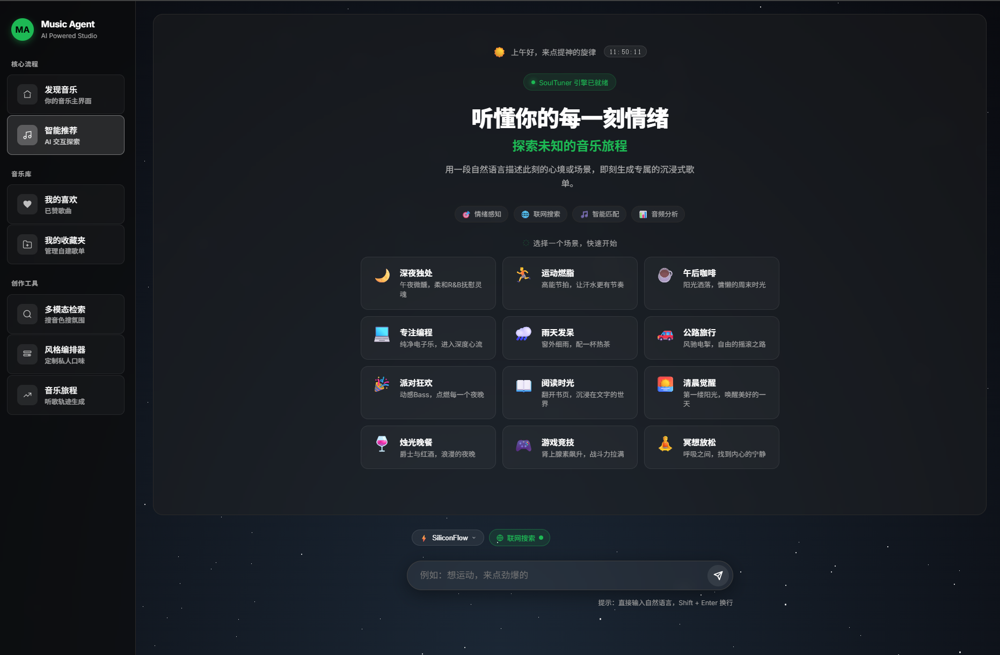
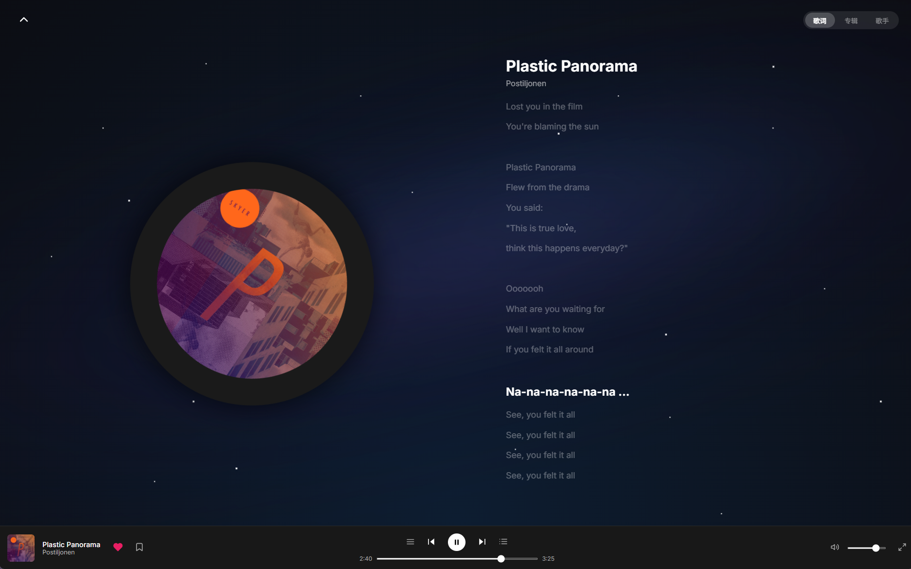

# 🎵 SoulTuner Agent

<p align="center">
  
</p>

<p align="center">
  <strong>A Multimodal AI Music Agent — Hybrid RAG × Knowledge Graph × Long-term Memory</strong>
</p>

<p align="center">
  
  
  
  
  
  
</p>

<p align="center">
  <a href="README.md">中文</a> | <a href="README_EN.md">English</a>
</p>

> A multi-node Agent workflow orchestrated by LangGraph that combines a Knowledge Graph (Neo4j), dual audio embedding models (M2D-CLAP + OMAR-RQ), Large Language Models, and GraphZep long-term memory to deliver hybrid retrieval, weighted RRF fusion, graph-distance reranking, SSE streaming recommendations, web search fallback, music journey curation, and a user behavior data flywheel.

---

## ✨ Core Features

| Feature | Description |
|---------|-------------|
| 🔀 **Hybrid RAG** | GraphRAG + Semantic Search concurrent retrieval with weighted RRF fusion |
| 🎵 **Dual Audio Embeddings** | M2D-CLAP cross-modal semantics × 0.7 + OMAR-RQ acoustic features × 0.3 |
| 🧠 **Long-term Memory** | GraphZep two-stage recall, cross-session user preference retention |
| 📊 **Graph Affinity** | Neo4j graph distance + user profile Jaccard dual personalized ranking |
| 🤖 **Dual Planner** | API large model (intent + tags + HyDE in one call) / Local small model (HyDE separated) |
| 👤 **User Profile** | Visual profile panel with genre/mood/scenario/language preferences → Neo4j + GraphZep dual-write |
| 🌐 **Web Search Fallback** | Auto-triggers SearxNG federated search + LLM summarization when local library is insufficient |
| 🎼 **Music Journey** | LLM story → emotion decomposition → segment-by-segment retrieval, SSE real-time push |
| ♻️ **Data Flywheel** | One-click ingestion: search → discover → download → tag extraction → vector encoding → Neo4j |
| 📡 **SSE Streaming** | Real-time frontend rendering: thinking → song cards → recommendation explanations |
| ⚙️ **Runtime Config** | Frontend settings panel for real-time adjustment of LLM, retrieval, and RRF parameters |
| 🐳 **Docker Deploy** | `docker compose up` for full-stack one-command startup |

---

## 🖼️ Feature Preview

### 🏠 Home · 💬 Chat · 🎵 Recommendations · 🎧 Player · 🗺️ Journey

<table>
  <tr>
    <td></td>
    <td></td>
  </tr>
  <tr>
    <td></td>
    <td></td>
  </tr>
  <tr>
    <td colspan="2"></td>
  </tr>
</table>

---

## 🏗️ System Architecture

```
┌─────────────────────────────────────────────────────────────────────┐
│  Frontend (Next.js :3003)                                           │
│  React UI  ·  Global Audio Player  ·  Music Journey  ·  Settings   │
└──────────────────────────────┬──────────────────────────────────────┘
                               │ SSE
┌──────────────────────────────▼──────────────────────────────────────┐
│  Backend (FastAPI :8501)                                            │
│  SSE Streaming API  ·  Settings API  ·  Static Audio Server        │
└──────────────────────────────┬──────────────────────────────────────┘
                               │
┌──────────────────────────────▼──────────────────────────────────────┐
│  LangGraph Agent (StateGraph)                                       │
│                                                                     │
│  start → GraphZep Recall → Planner (LLM) → Intent Router          │
│                                                                     │
│     ┌─────────┬─────────┬─────────┬──────────┐                     │
│     ▼         ▼         ▼         ▼          ▼                     │
│  search_songs  chat  acquire  gen_reco  journey                    │
│     │                                                               │
│     ▼                                                               │
│  Hybrid Retrieval ──→ LLM Explainer ──→ Pref Extract ──→ GraphZep Write → end │
└──────────────────────────────┬──────────────────────────────────────┘
                               │
┌──────────────────────────────▼──────────────────────────────────────┐
│  Hybrid Retrieval Engine                                            │
│                                                                     │
│  ┌─────────────┐  ┌──────────────────┐  ┌──────────────┐          │
│  │  GraphRAG   │  │  Semantic Search  │  │  Web Search  │          │
│  │  Neo4j      │  │  M2D-CLAP+OMAR   │  │  SearxNG     │          │
│  └──────┬──────┘  └────────┬─────────┘  └──────┬───────┘          │
│         └──────────────────┼───────────────────┘                   │
│                            ▼                                        │
│              Weighted RRF Fusion (α·Vector + β·Graph)              │
│                            ▼                                        │
│              Graph Affinity (Graph Distance + Profile Jaccard)      │
│                            ▼                                        │
│              Artist Diversity Filter (exempt specified artists)     │
│                            ▼                                        │
│              MMR Jaccard Rerank (λ=0.7)                            │
└─────────────────────────────────────────────────────────────────────┘
                               │
┌──────────────────────────────▼──────────────────────────────────────┐
│  Storage Layer                                                      │
│  Neo4j (Graph + Vectors)  ·  GraphZep Memory (:3100)               │
└─────────────────────────────────────────────────────────────────────┘
```

### Tech Stack

| Layer | Technology |
|-------|------------|
| **Frontend** | Next.js 14 (App Router) + React 18 + TypeScript 5.5 + Framer Motion 12 |
| **State Mgmt** | React Context API (PlayerContext + LibraryContext) |
| **Design** | CSS-in-JS custom theme.ts (Spotify-inspired dark design system) |
| **Agent** | LangGraph StateGraph (7 intent routing / dual Planner) |
| **Backend** | FastAPI + Uvicorn (ASGI), SSE streaming, Pydantic schema validation |
| **Async I/O** | Python asyncio fully async (concurrent retrieval + GraphZep fire-and-forget writes) |
| **Graph DB** | Neo4j 5.x (native vector index + graph relations + user behavior direct-write) |
| **Audio Embed** | M2D-CLAP 2025 (cross-modal semantic, 768d) + OMAR-RQ (pure acoustic, 768d) |
| **AI Inference** | PyTorch ≥2.2 + torchaudio (GPU/CPU adaptive, lazy-load singleton cache) |
| **LLM** | DeepSeek-V3 / Gemini / Doubao (Volcengine) / Qwen (API) + Qwen3-4B (SGLang local deployment) |
| **Memory** | GraphZep (Hono + TypeScript microservice, temporal knowledge graph, two-stage recall) |
| **Web Search** | SearxNG federated search + Tavily + Zhipu WebSearch |
| **Ranking** | Dual-anchor rerank (cosine) + Graph Affinity (shortestPath + Jaccard) + MMR |
| **Context Mgmt** | GSSC Token Budget Pipeline V3 (Gather/Select/Structure/Compress) with LLM summary + **async pre-compression cache** (background compression after each round, instant cache hit on next) |
| **Container** | Docker Compose (Neo4j + GraphZep + Backend + Frontend) |

---

## 🚀 Quick Start

### Option 1: Docker Compose (Recommended)

```bash
# 1. Copy and configure environment variables
cp .env.example .env
# Edit .env and fill in your API Keys

# 2. One-command startup
docker compose up -d

# 3. Access
# Frontend: http://localhost:3003
# Backend:  http://localhost:8501
# Neo4j:    http://localhost:7474
```

### Option 2: Local Development (Conda)

```bash
# Setup environment
conda create -n music_agent python=3.11
conda activate music_agent
pip install -r requirements.txt
cd web && npm install && cd ..

# Start all services
python startup_all.py

# Or run frontend/backend separately
conda activate music_agent; python startup_all.py --no-web    # Terminal A: Backend
cd web && npm run dev             # Terminal B: Frontend (hot reload)
```

### Option 3: Local LLM Deployment (WSL + SGLang)

Optimized deployment for 8GB VRAM devices (e.g., RTX 4070), supporting 4B-level fine-tuned local models (e.g., `Qwen-4B`) while reserving VRAM for the cross-modal retrieval system.

**Prerequisites**:

1. Windows with WSL2 (Ubuntu) enabled
2. CUDA Toolkit installed in WSL (only `nvcc` needed)
3. `sglang[all]` installed in a WSL virtual environment

**Launch Steps**:

1. **Terminal A (WSL)**: Start the LLM inference engine

   ```bash
   wsl
   bash /path/to/SoulTuner-Agent/scripts/start_sglang.sh
   ```

   *Built-in VRAM partitioning: FP8 online quantization locks 70% VRAM (~5.5GB), reserving space for audio vector models.*

2. **Terminal B (Windows)**: Switch to local model in the frontend settings
   - Run `python startup_all.py` normally
   - Open System Settings ⚙️
   - **Main Provider**: Select `sglang`
   - **Base URL**: Enter `http://localhost:8000/v1`
   - Save settings — the system will automatically switch to the local 4B model using the streamlined Planner

> ⚠️ Start Neo4j Desktop and launch the database before starting.

<details>
<summary>Manual step-by-step startup</summary>

| Terminal | Command | Port |
|----------|---------|------|
| 0 | Start Neo4j Desktop database | `:7687` |
| 1 | `cd graphzep_service/server && npm run dev` | `:3100` |
| 2 | `python start.py --mode api` | `:8501` |
| 3 | `cd web && npm run dev` | `:3003` |
| 4 | `docker compose -f docker-compose.searxng.yml up -d` | `:8888` |

</details>

---

## 📁 Project Structure

```
.
├── agent/                      # LangGraph Agent
│   ├── music_agent.py          # Agent entry point
│   └── music_graph.py          # StateGraph workflow (7 intent routing)
│
├── api/                        # FastAPI interface layer
│   ├── server.py               # Main server + Settings API
│   └── user_profile.py         # User Profile API (GET/POST /api/user-profile)
│
├── config/settings.py          # Global config (supports runtime modification)
│
├── retrieval/                  # Retrieval engine layer
│   ├── hybrid_retrieval.py     # Multi-source fusion + RRF + Graph Affinity + MMR
│   ├── gssc_context_builder.py # GSSC V3 context pipeline (Token budget + LLM compress + async pre-compress cache)
│   ├── audio_embedder.py       # M2D-CLAP cross-modal encoding
│   ├── neo4j_client.py         # Neo4j connection wrapper
│   ├── music_journey.py        # Music journey orchestrator
│   └── user_memory.py          # User preference Neo4j memory
│
├── tools/                      # Tool layer
│   ├── graphrag_search.py      # Knowledge graph retrieval (Neo4j Cypher, 5-dim tags)
│   ├── semantic_search.py      # Vector retrieval (M2D-CLAP + OMAR)
│   ├── web_search_aggregator.py # Web search aggregation (SearxNG + Tavily)
│   └── acquire_music.py        # Data flywheel (download & ingest)
│
├── llms/                       # LLM interfaces + Prompts
│   ├── prompts.py              # Dual Planner (SYSTEM/HUMAN split + streamlined) + 6 auxiliary prompts
│   └── multi_llm.py            # Multi-provider LLM factory (SiliconFlow / Volcengine / Gemini / OpenAI)
│
├── schemas/                    # Pydantic data models
│   └── query_plan.py           # MusicQueryPlan + RetrievalPlan
│
├── services/                   # External service clients (GraphZep)
│
├── data/pipeline/              # Data pipeline
│   ├── ingest_to_neo4j.py      # Neo4j ingestion
│   ├── neo4j_schema_v2.py      # Dataset management CLI (list/verify/backfill)
│   └── lyrics_analyzer.py      # LLM lyrics tag analysis
│
├── web/                        # Next.js frontend
│   ├── components/Settings/    # ⚙️ Runtime settings panel
│   ├── components/Profile/     # 👤 User profile panel
│   └── components/Navigation/  # Navigation & sidebar
│
├── graphzep_service/           # GraphZep microservice
├── docker-compose.yml          # Docker full-stack orchestration
├── Dockerfile                  # Backend image
├── .env.example                # Environment variable template
├── startup_all.py              # Local one-click launcher
└── requirements.txt            # Python dependencies
```

---

## 🔧 Data Pipeline

Run on first deployment or when adding new music:

```bash
# 1. Lyrics tag extraction (LLM automated)
python data/pipeline/lyrics_analyzer.py

# 2. Ingest to Neo4j
python data/pipeline/ingest_to_neo4j.py              # Full ingestion
python data/pipeline/ingest_to_neo4j.py --skip-embeddings   # Metadata only
python data/pipeline/ingest_to_neo4j.py --update-embeddings # Vectors only
```

### Dataset Management CLI

```bash
# View song distribution by dataset
python data/pipeline/neo4j_schema_v2.py --list-datasets

# Verify vector index status
python data/pipeline/neo4j_schema_v2.py --verify

# Backfill missing dataset labels
python data/pipeline/neo4j_schema_v2.py --backfill
```

---

## ⚙️ Configuration

### Environment Variables

| Variable | Description | Default |
|----------|-------------|---------|
| `OPENAI_BASE_URL` | LLM API endpoint | `https://api.siliconflow.cn/v1` |
| `OPENAI_API_KEY` | LLM API key | — |
| `MODEL_NAME` | Main inference model | `deepseek-ai/DeepSeek-V3` |
| `VOLCENGINE_BASE_URL` | Volcengine (Doubao) API endpoint | `https://ark.cn-beijing.volces.com/api/v3` |
| `VOLCENGINE_API_KEY` | Volcengine API key | Optional |
| `NEO4J_URI` | Neo4j connection | `neo4j://127.0.0.1:7687` |
| `NEO4J_PASSWORD` | Neo4j password | — |
| `TAVILY_API_KEY` | Web search | Optional |
| `GOOGLE_API_KEY` | Gemini API | Optional |

### Runtime Settings (Frontend)

The frontend settings panel (⚙️ System Settings) supports real-time adjustment:

| Category | Adjustable Parameters |
|----------|----------------------|
| **Model Config** | Main LLM provider/model, intent analysis model, local model toggle, timeout |
| **Retrieval Params** | Graph/vector/playlist counts, RRF weights, graph distance weighting toggle/weight/hops |
| **Music Data** | Local music/MTG/web-acquired/model export directories |
| **Memory System** | Context retention rounds, user ID |

Changes take effect immediately upon saving. Unsaved changes are discarded when closing the panel. Supports "↩ Reset Defaults".

---

## 🔌 API Endpoints

### SSE Streaming

| Endpoint | Description |
|----------|-------------|
| `POST /api/recommendations/stream` | Music recommendations (SSE: thinking → song × N → response → complete) |
| `POST /api/journey/stream` | Music journey (SSE: segment_start → song × N → segment_complete × M) |

### REST — User Behavior

| Endpoint | Description |
|----------|-------------|
| `POST /api/user-event` | User event reporting (like/unlike/save/unsave/skip/dislike/full_play/repeat) |
| `GET /api/liked-songs` | Get user liked + saved songs (from Neo4j, with time-decay sorting) |
| `GET /api/disliked-songs` | Get user disliked songs (from Neo4j) |
| `DELETE /api/disliked-songs` | Remove dislike marks (delete DISLIKES relation from Neo4j) |

### REST — Features

| Endpoint | Description |
|----------|-------------|
| `POST /api/search` | Non-streaming song search |
| `POST /api/acquire-song` | Data flywheel: download audio/cover/lyrics → dual-model encoding → Neo4j ingestion |
| `GET /api/user-profile` | Read user profile preferences |
| `POST /api/user-profile` | Save user profile → Neo4j User properties + GraphZep long-term memory |
| `GET /api/settings` | Get current runtime configuration |
| `POST /api/settings` | Update runtime configuration (takes effect immediately) |
| `POST /api/settings/reset` | Reset to default configuration |
| `GET /health` | Health check |

---

## 🙏 Acknowledgments

The initial architecture of this project is inspired by [imagist13/Muisc-Research](https://github.com/imagist13/Muisc-Research), with extensive refactoring and feature expansion.

| Project | Usage |
|---------|-------|
| [aexy-io/graphzep](https://github.com/aexy-io/graphzep) | GraphZep long-term memory |
| [nttcslab/m2d](https://github.com/nttcslab/m2d) | M2D-CLAP cross-modal model |
| [MTG/omar](https://github.com/MTG/omar) | OMAR-RQ audio model |
| [langchain-ai/langgraph](https://github.com/langchain-ai/langgraph) | Agent orchestration |
| [searxng/searxng](https://github.com/searxng/searxng) | Federated meta-search |

---

## 📄 License

MIT License

⚠️ **Disclaimer**: This project is for learning and architectural research only. **Commercial use is strictly prohibited.** It does not provide, include, or distribute any copyrighted audio or lyrics resources. Audio data must be obtained by users through legitimate channels.
